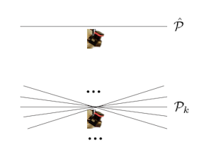
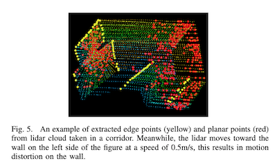
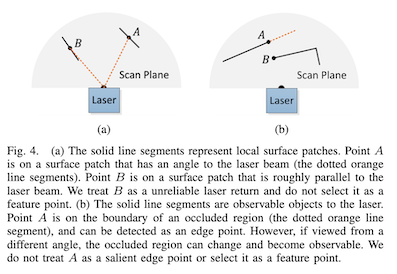
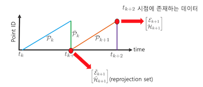
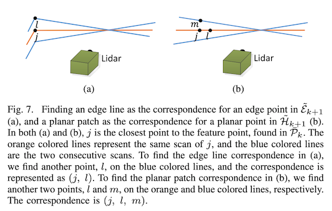
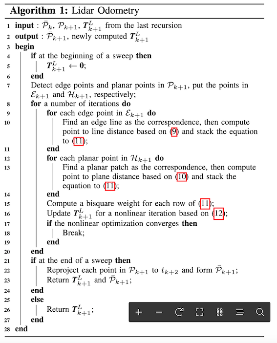
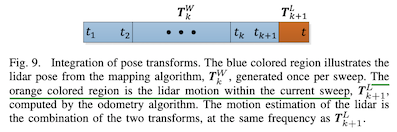
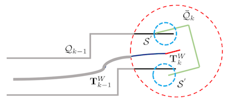

# LOAM Paper Summary

## Abstract

- 기계식 레이저-스캐닝 장비를 이용해서 low drift odometry를 수행하고 이를 이용해 map을 생성하는 경우를 다룬다.
- LOAM의 특징
  - low drift motion estimation
  - low computational complexity
- 라이다 기반 SLAM문제를 2개의 문제로 나누어 실행함.
  - Odometry: 높은 주기로 실행되는 odometry (속도 정확도는 낮음)
  - Mappoint: 상대적으로 낮은 주기로 실행되는 fine matching 과 point cloud registration
- Loop Closing 수행안함.
  - low drift의 3D Map을 만드는데 초점을 맞춤.
  - 하지만 실제로는 라이다로 Loop Closing하는 것은 영상과 달리 딱히 대중적으로 사용되는 기법이 없음. 안한 것이 아니라 못한 것으로 생각됨.

## Introduction

- LIDAR 센서는 다른 센서와 비교할 때 상대적으로 거리오차가 매우 작기 때문에 다양한 Mapping 알고리즘이 연구되었다. (대략 150m에 오차 2.5 cm 발생)
- 레이저-스캐닝 장비의 단점은 point cloud를 registration하기 위해 레이저가 움직여야한다는 점이다. 이 때, 레이저-스캐닝 장비 내에서 레이저가 움직이는 internal kinematics는 우리가 알 수 있다. 따라서 고정되어 있는 상황에서는 point registration에 큰 문제가 발생하지 않는다. 하지만 우리는 움직이는 장비에 레이저-스캐닝 장비에 장착해 놓았기 때문에 external motion에 대해서도 알아야한다.
- 이 문제를 해결하기 위해서는 pose estimation을 수행하는 독립적인 시스템 (ex. GPS/INS 시스템)을 사용해서 external motion을 보상하거나 이러한 독립적인 시스템의 사용이 불가능한 경우는 레이저-스캐닝 장비를 이용한 odometry를 수행한다. 여기서는 레이저-스캐닝 장비를 이용한 odometry를 수행하고 Mapping을 통해 drift를 최소화하는 것을 다룬다.
- LOAM은 SLAM을 2가지 문제로 나누어 대응한다.
  - 높은 주기로 실행되는 odometry
  - Online velocity estimation을 수행함. 정확도는 높지 않음.
  - IMU등을 사용하여 Motion-prior를 줄 수 있다면 좋지만 필수적인 것은 아님.
  - 속도를 중시해서 feature point 중 일부 만 사용하여 알고리즘을 수행함.
  - 상대적으로 낮은 주기로 실행되는 fine matching 및 point cloud registration
  - batch optimization을 이용해 map을 구성하고 high precision motion estimation을 수행함.
  - 정확도를 중시해서 알고리즘을 수행하며, 그에 따라 더 많은 feature point를 사용하고 더 많은 iteration을 수행함.
- LOAM은 edge와 planar surface에 있는 feature point를 추출하며, 이것을 edge-line segment 혹은 planar surface patch와 정합한다.
  - Odometry에서는 속도를 중시해 feature를 추출하고, fine matching에서는 정확도를 중시해 feature를 추출한다.

## Related work

### Lidar

- point cloud의 motion에 따른 distortion문제를 해결하기 위해 stop-to-scan을 사용하기도 한다.(Nuchter et al. 2007) 하지만 scanning rate이 extrinsic motion에 비해 높다면, distortion을 무시할 수 있고, 이 경우, 그냥 간단히 ICP(Pomerleau et al. 2013)을 사용하기도 한다. ICP-based velocity estimation을 한 후, distortion compensation을 하는 방식도 있다.(Hong et al. 2010)

### 2-axis lidar

- 2-axis lidar의 경우, 한 축이 다른 한 축에 비해 scanning rate이 느린 경우가 많아 문제가 되는 경우가 많다. 다른 motion estimation 시스템을 이용해 distortion 문제를 제거할 수도 있다. 2-axis lidar 단독인 경우는 motion model을 constant velocity로 가정하고 Gaussian process를 도입해서 continuous motion estimation을 수행하는 경우가 많다. (Tong and Barfoot 2013; Anderson and Barfoot 2013) LOAM의 경우, odometry에서는 linear motion model을 이용하고, mapping에서는 rigid-body transform을 사용한다. Zebedee (Bosse and Zlot 2009, 2012; Bosse et al. 2012)란 시스템도 있는데, 3D mapping device with 2D lidar and IMU이며, data set을 segment하고 경계 조건을 생성하여 전체 trajectory에 대한 Batch optimization을 수행한다.( IMU bias와 drift도 추정하여 보상한다.) 그에 따라 맵을 Real-time으로 얻을 수 없다.

### Rolling-shutter camera

- Rolling Shutter Camera 경우도, motion distortion 문제 있다.(Li and Mourikis 2014)는 IMU mechanization을 이용해 motion을 보상한다. IMU를 이용해 non-linear motion 부분은 상쇄하고 linear motion model을 만들어서 Filtering을 수행한다.

### Lidar features

- Dense point cloud에서 laser intensity를 visual image로 변환해서 다루기도 하며, Point cloud에서 spatio-temporal patch를 뜯어서 local point cluster를 생성하여 맵을 생성하기도 한다. 보통은 edge와 local planar surface를 뜯어서 기하학적 특징을 생성하고 이용한다.

## Notation and task description

### Problem & Assumption

- 3D point cloud에서 ego-motion estimation을 수행함.
- 주변 환경에 대한 맵을 생성함.
- lidar는 internal kinematics를 포함하여 internal calibration이 되어 있다고 가정함.
- sweep : lidar가 coverage를 한번 scan하는 것
  - $\mathcal{P}_k$ : sweep k에 받은 point cloud

### Coordinates

- Lidar frame {$L$}
  - x: left, y:upward, z: forward
  - $X_{(k,i)}^{L}$ : {$L_k$} 에서 표현되 sweep _k_ 동안 받아진 point _i_
  - $T_{k}^{L}(t)$ : 시간 _t_에 받아진 point를 sweep _k_ 의 시작시간의 좌표계인 {$L_k$}의 point로 변환하는 변환행렬
- World frame {$W$}
  - 초기화 시점의 {$L$}을 {$W$}로 정함.
  - $X_{(k,i)}^{W}$ : $\{W\}$에서 표현된 sweep _k_ 동안 받아진 point _i_
  - $T_{k}^{W}(t)$ : 시간 _t_ 에 받아진 라이다의 point를 {$W$}의 point로 변환하는 변환행렬

## System overview

### Lidar Hardware

#### Hokuyo UTM-30LX

- Field of View (FOV): $180^{\circ}$ 
- Angular resolution: $0.25^{\circ}$ 
- Scan raet : 40 line/sec
- 회전모터: $180^{\circ}/sec$ between $-90^{\circ}$ and $90^{\circ}$
  - 수평방향을 스캔하는 2D 라이다를 회전 모터를 이용해 롤 방향 회전시켜서 데이터를 얻는 것으로 보임.
  - 다른 라이다를 사용할 경우에는 그에 맞게 라이다의 point cloud를 처리해야 함. 

## Software System Overview

- $\hat{\mathcal{P}}$: 레이저 스캔을 통해 받아진 점들의 집합
- $\mathcal{P}$: sweep _k_동안 받아진 각 스캔을 통해 받아진 $\hat{\mathcal{P}}$를 하나로 합쳐진 점들의 집합. 
  - 각 스캔 간의 시간 차이에 따른 모션 보상이 이루어져서 합져침. 
  - odometry와 mapping에 모두 사용됨.

- Lidar Odometry: 2개의 연속된 sweep을 받아서 상대 포즈를 구함.(10Hz)
- Lidar Mappoing: odometry를 통해 상대 포즈가 포상된 $\mathcal{P}_k$를 기존의 Map에 있는 point cloud와 비교하여 더 정밀한 포즈를 계산하고, 이를 이용하여 라이다에서 새롭게 들어온 ponit cloud를 Map에 등록함.(1Hz)
- Transform Integration: odometry와 mapping 결과를 조합하여 10Hz로 현재의 포즈를 계산하고 출력함.

## Lidar Odometry

### Feature Point Extraction

- 하나의 sweep은 1Hz동안 스캔된 point cloud들의 집합이며, 하나의 sweep은 40개의 스캔으로 구성된다(40 scan/sec, 수직방향 Angular resolution $4.5^{\circ}$)
- 특징점은 에지 (sharp edge)와 평면 패치 (planar surface patch)로 구성됨.

- $\mathcal{S}$: 같은 라이다 스캔 상에서 연속한 점들의 집합이며, 중심점을 기준으로 양쪽으로 $0.25^{\circ}$ 간격ㅇ로 구성된 점들이다.
- 이 점들의 집합으로 부터 평면의 smoothness를 계산할 수 있음. (코드 상에서는 curvature로 나옴)

$$
c = \frac{1}{\lvert \mathcal{S}\rvert \cdot \lVert \mathbb{X}^{L}_{(k,i)}\rVert} \cdot \left\lVert{\sum\limits_{j\in \mathcal{S}, j  \neq i}{\mathbb{X}^L_{(k,i)} - \mathbb{X}^L_{(k,j)} }}\right\rVert
$$

- 특징점 추출을 위해 다음의 과정을 수행함.
  - 각 스캔을 4개의 서브영역으로 구분함.
  - 각각의 영역에서 smoothness를 기준으로 sorting함.
  - 가장 큰 점들 2개를 에지로, 가장 작은 점들 4개를 평면 패치로 선택함. 어설픈 점들이 섞이지 않도록 각 특징 별로 문턱치를 정해서 그것을 통과한 특징점들만 선택함.

#### Degenerate case

다음과 같은 경우는 예외적으로 처리한다.

- Laser Beam과 거의 평행한 평면 패치 내부의 점인 경우
  - 이런 경우는 평면 패티의 법선벡터와 빔 방향의 내적을 구해 그것이 0에 가까우면 제외함.
- 음영지역으로 인해 에지가 아닌 점이 에지로 오인되는 경우
  - 빔 방향으로 특정 거리만큼 차이나는 경우는 뒷쪽의 데이터는 제외한다.

### Finding Feature Point Correspondence

- $\mathcal{P}_{k+1} = \{\tilde{\mathcal{E}}_{k+1}, \tilde{\mathcal{H}}_{k+1}\}$: 라이다에서 k+1번째 sweep 동안 누적된 point cloud를 k+1번째 sweep이 시작하는 시점인 $t_{k+1}$ 투영한 점들
  - $\tilde{\mathcal{E}}_{k+1} \subset \mathcal{P}_{k+1}$: 에지 특징점들의 집합
  - $\tilde{\mathcal{H}}_{k+1} \subset \mathcal{P}_{k+1}$: 평면 패치 특징점들의 집합
- $\bar{\mathcal{P}}_{k}$: 라이다에서 k번째 sweep 동안 누적된 point cloud를 k번째 sweep이 끝나는 시점인 $t_{k+1}$ 투영한 점들

결국 $\bar{\mathcal{P}}_{k}$와 $\mathcal{P}_{k+1}$는 동일 시점의 서로 다른 sweep에서 획득된 3D point cloud의 점들이므로 이 두 점들 간의 상관관계를 찾아야 함. 상관관계는 3D KD-tree를 이용하여 closest neighbor point을 찾는다.

#### Edge Features

1. $i \in \tilde{\mathcal{E}}_{k+1}$를 선택한다.
1. $i$와 가장 가까운 점 $j\in \bar{\mathcal{P}}_{k}$를 구한다.
1. $j$와 연속적으로 위치한 다른 scan 상의 점 $l\in \bar{\mathcal{P}}_{k}$을 찾는다.
1. $(j,l)$이 Edge points라는 것을 증명하기 위해 Local Surface의 Smoothness $𝒄$ 를 계산한다.
1. $(j,l)$이 Edge feature이면, $i$와 $(j,l)$로 구성된 에지 사이의 거리를 다음의 공식으로 구하고, 이것들을 최소화하다록 최적화를 수행한다.
   - 사인 공식으로 쉽게 유도된다.

    $$d_{\mathcal{E}} = \frac{\left\lVert{\left(\tilde{\mathbb{X}}^L_{(k,i)} - \bar{\mathbb{X}}^L_{(k-1,j)}\right)\times \left(\tilde{\mathbb{X}}^L_{(k,i)} - \bar{\mathbb{X}}^L_{(k-1,l)}\right)}\right\rVert}{\left\lVert{\bar{\mathbb{X}}^L_{(k-1,j)} - \bar{\mathbb{X}}^L_{(k-1,l)}}\right\rVert}$$

#### Planar Featrues

1. $i \in \tilde{\mathcal{H}}_{k+1}$를 선택한다.
1. $i$와 가장 가까운 점 $j\in \bar{\mathcal{P}}_{k}$를 구한다.
1. $j$와 연속적으로 위치한 같은 scan 상의 점 $l\in \bar{\mathcal{P}}_{k}$을 찾는다.
1. $j$와 연속적으로 위치한 다른 scan 상의 점 $m\in \bar{\mathcal{P}}_{k}$을 찾는다. 
1. 이렇게 구한 $(j,l,m)$이 Planar points라는 것을 증명하기 위해 Local Surface의 Smoothness $𝒄$ 를 계산한다.
1. $(j,l,m)$이 평면 패치 특징점이면, $i$와 $(j,l,m)$ plane 사이의 거리를 다음의 공식으로 구하고, 이것들을 최소화하다록 최적화를 수행한다.

    $$d_{\mathcal{H}} = \left(\mathbb{X}^L_{(k,i)} - \bar{\mathbb{X}}^L_{(k-1,j)}\right)\cdot\frac{{{\left(\mathbb{X}^L_{(k-1,j)} - \bar{\mathbb{X}}^L_{(k-1,l)}\right)\times \left(\mathbb{X}^L_{(k-1,j)} - \bar{\mathbb{X}}^L_{(k-1,m)}\right)}}}{\left\lVert{\left(\mathbb{X}^L_{(k-1,j)} - \bar{\mathbb{X}}^L_{(k-1,l)}\right)\times \left(\mathbb{X}^L_{(k-1,j)} - \bar{\mathbb{X}}^L_{(k-1,m)}\right)}\right\rVert}$$

### Motion Estimation

#### Assumption

- 라이다 모션은 sweep동안 constant angular and linear velocity로 모델링함.
  
  - 서로 다른 시간에 들어온 스캔 데이터의 포즈를 보간하여 사용할 수 있게 됨. 
- $t$: 현재 시간
- $t_{k+1}$: _k+1_ sweep의 시작시간
- $T^{L}_{k+1} = [t_x, t_y, t_z, \theta_x, \theta_y, \theta_z]^T$: 시간 $[t_{k+1}, t]$ 사이의 라이다 포즈 변환 행렬
- $T^{L}_{k+1,i}$: $i\in \mathcal{P}_{k+1}$에 대한 시간 $[t_{k+1}, t_i]$ 사이의 라이다 포즈 변환 행렬

    $T^{L}_{k+1,i} = \frac{t_i -t_{k+1}}{t-t_{k+1}}T^{L}_{k+1}$

#### Nonlinear Least Square

- 에지
    $f_{\mathcal{E}} \left( X^L_{k+1, i}, T^L_{k+1}\right) = d_{\mathcal{E}}, \quad i\in \mathcal{E}_{K+1}$
- 평면 패치
    $f_{\mathcal{H}} \left( X^L_{k+1, i}, T^L_{k+1}\right) = d_{\mathcal{H}}, \quad i\in \mathcal{H}_{K+1}$
- 위의 두 비용함수를 이용하여 비선현 최적화를 Levenberg-Marquardt 기법으로 푼다.

### Lidar Odometry Algorithm

- 1 line: $t_{k+1}$에서 $\bar{\mathcal{P}}_k, \mathcal{P}_{k+1}, T^L_{k+1}$값을 입력으로 받는다.
- 4-6 line: sweep을 시작할 때, $T^L_{k+1}$을 초기화한다.
- 7 line: 특징점을 추출한다.
- 9-11 line: 에지 특징점에 대하여 상관관계를 찾고, 거리를 계산한다.
- 12-14 line: 평면 특징점에 대하여 상관관계를 찾고, 거리를 계산한다.
- 15-19 line: 비선형 최적화를 수행한다.
- 21-24 line: sweep이 끝나면, sweep이 끝나는 시점인 $t_{k+2}$로 $\mathcal{P}_{k+1}$을 투영하여 $\bar{\mathcal{P}}_{k+1}$을 구하고 $T^L_{k+1}$과 함께 출력한다.
- 25-27 line: 비선형 최적화를 통해 구한 $T^L_{k+1}$을 출력한다.

## Lidar Mapping

- 라이다 매핑은 sweep이 끝난 순간마다 (1Hz) 수행된다. 
- sweep이 끝나면, odomtery는 $\bar{\mathcal{P}}_{k+1}$와 $T^L_{k+1}$을 출력한다.
- $\bar{\mathcal{P}}_{k+1}$와 맵 상의 점들과의 상관관계를 구하고 이를 이용하여 odometry에서 출력한 포즈의 오차를 줄임과 동시에 맵 상에 등록하는 것이 매핑의 핵심이다.
- 특징점을 추출하는 방법은 odometry와 동일하지만 odomtery보다 10배 많은 수의 특징점을 사용하여 최적화를 수행한다.
- 연산량을 고려하여 현재 위치 주변의 10m 큐빅내의 점들만 사용한다.
- 최종적으로 포즈의 출력은 odometry만 수행될 때는 odometry 기반으로 누적하여 출력하고, odomertry와 mapping이 동시에 수행되면, mapping 결과를 이용하여 출력한다.

### Input & Output

- ${\mathcal{Q}}_{k}$: k번째 sweep까지 누적된 $\{W\}$에서의 point cloud. (현재 시점의 저장된 맵을 의미함.)
- ${\mathcal{T}}^{W}_{k}$: k번째 sweep이 끝난 시점에서의 $\{W\}$대비 라이다 포즈 ($@t_{k+1}$)
- $\bar{\mathcal{P}}_{k+1}$: 라이다에서 k+1번째 sweep 동안 누적된 point cloud를 k번째 sweep이 끝나는 시점인 $t_{k+2}$으로 투영한 점들
- $\bar{\mathcal{Q}}_{k+1}$: 라이다에서 k+1번째 sweep 동안 누적된 point cloud를 $\{W\}$으로 투영한 점들
<!-- - $\!^{L}{\mathcal{T}}_{k+1}$: odometry를 통해 만들어진 상대 포즈, 정확히는 $\!^{L_{k}}{\mathcal{T}}_{L_{k+1}}$ 를 의미함. -->

### Algorithm

1. 이전 매핑 알고리즘의 포즈 ${\mathcal{T}}^{W}_{k}$와 odomtery결과로 얻어진 상대 포즈 ${\mathcal{T}}^{L}_{k+1}$를 이용하여 $\bar{\mathcal{P}}_{k+1}$를 $\bar{\mathcal{Q}}_{k+1}$로 변환한다.
1. ${\mathcal{Q}}_{k}$를 3D KD-tree로 저장하고 $\bar{\mathcal{Q}}_{k+1}$의 특징점들과 상관관계를 찾는다.
1. 상관관계가 찾아지면, ${\mathcal{Q}}_{k}$에서 상관관계가 찾아진 점들의 집합 $\mathcal{S}^{\prime}$을 Eigen decomposion하여 특징점의 특성이 맞는지 점검한다.
    - $M$: $\mathcal{S}^{\prime}$의 공분산, 평균은 $\mathcal{S}^{\prime}$의 기하학적 중심으로 생각하여 계산된 것임.
    - $V,\ E$: $M$의 eigen value와 eigen vector
    - 에지: $V_1 \gg V_2, V_3$ 의 특성을 가짐.
    - 평면: $V_1, V_2 \gg V_3$ 의 특성을 가짐.
1. 최적화 문제를 풀어서 ${\mathcal{T}}^{W}_{k+1}$을 구한다.
1. $\bar{\mathcal{Q}}_{k+1}$를 맵에 등록하여 $\mathcal{Q}_{k+1}$를 구한다.

## Appendix

### Edge feature Jacobian

- ${d}_{\mathcal{E}}$를 벡터 $\vec{d}_{\mathcal{E}}$의 놈으로 모델링할 수 있음.
- $\vec{d}_{\mathcal{E}}$의  분자 부분은 상수로 생각가능함.

$$
\begin{align}
d_{\mathcal{E}} &= f\left(\vec{d}_{\mathcal{E}}\right) \quad \text{where } f(\cdot) = \|\cdot\|^{2} \\
\vec{d}_{\mathcal{E}} &= \frac{\left(\tilde{\mathbf{X}}^L_{(k,i)} - \bar{\mathbf{X}}^L_{(k-1,j)}\right)\times \left(\tilde{\mathbf{X}}^L_{(k,i)} - \bar{\mathbf{X}}^L_{(k-1,l)}\right)}{\left\lVert{\bar{\mathbf{X}}^L_{(k-1,j)} - \bar{\mathbf{X}}^L_{(k-1,l)}}\right\rVert}
\end{align}
$$

- $\vec{d}_{\mathcal{E}}$ 는 $\tilde{\mathbf{X}}^L_{(k,i)}$ 의 함수로 생각 가능함.
- $\tilde{\mathbf{X}}^L_{(k,i)}$는 입력  ${\mathbf{X}}^L_{(k,i)}$와 포즈 변수 $\xi = log(^{k+2}T_{k+1})$의 함수로 생각 가능함.

$$
\begin{align}
\vec{d}_{\mathcal{E}} &= g\left(\tilde{\mathbf{X}}^L_{(k,i)}\right)\\
\tilde{\mathbf{X}}^L_{(k,i)} &= R^{-1}\cdot\left(\mathbf{X}^L_{(k,i)} - \vec t \right)
\end{align}
$$

#### Chain Rule

$$
\frac{\partial d_{\mathcal{E}}}{\partial \delta \xi} = \frac{\partial d_{\mathcal{E}}}{\partial \vec{d}_{\mathcal{E}}}\cdot \frac{\partial\vec{d}}{\partial \tilde{\mathbf{X}}^L_{(k,i)}}\cdot \frac{\partial \tilde{\mathbf{X}}^L_{(k,i)}}{\partial \delta \xi}
$$

- 1st component

$$
\frac{\partial d_{\mathcal{E}}}{\partial \vec{d}_{\mathcal{E}}} = \frac{\vec{d}^T_{\mathcal{E}}}{d_{\mathcal{E}}}
$$

- 2nd component

$$
\begin{align}
\vec{d}_{\mathcal{E}} &= \frac{\left(\tilde{\mathbf{X}}^L_{(k,i)} - \bar{\mathbf{X}}^L_{(k-1,j)}\right)\times \left(\tilde{\mathbf{X}}^L_{(k,i)} - \bar{\mathbf{X}}^L_{(k-1,l)}\right)}{\left\lVert{\bar{\mathbf{X}}^L_{(k-1,j)} - \bar{\mathbf{X}}^L_{(k-1,l)}}\right\rVert} \\
&= \frac{\left(\bar{\mathbf{X}}^L_{(k-1,l)} - \bar{\mathbf{X}}^L_{(k-1,j)}\right)\times \tilde{\mathbf{X}}^L_{(k,i)} + \bar{\mathbf{X}}^L_{(k-1,j)}\times\bar{\mathbf{X}}^L_{(k-1,l)}}{\left\lVert{\bar{\mathbf{X}}^L_{(k-1,j)} - \bar{\mathbf{X}}^L_{(k-1,l)}}\right\rVert}\\
\frac{\partial \vec{d}_{\mathcal{E}}}{\partial \tilde{\mathbf{X}}^L_{(k,i)}} &= \frac{\left(\bar{\mathbf{X}}^L_{(k-1,l)} - \bar{\mathbf{X}}^L_{(k-1,j)}\right)^{\wedge}}{{\left\lVert{\bar{\mathbf{X}}^L_{(k-1,j)} - \bar{\mathbf{X}}^L_{(k-1,l)}}\right\rVert}}
\end{align}
$$

- 3rd component

$$
\begin{align}
\tilde{\mathbb{X}}^L_{(k,i)} &= \mathbf{R}^{-1}\cdot\left(\mathbf{X}^L_{(k,i)} - \vec{\mathbf{t}}\right) \\
\mathbf{R} &= \!^{k+2}\mathbf{R}_{k+1} = \hat{\mathbf{R}}\left(I+\delta\phi^{\wedge}\right)\\
\vec{\mathbf{t}} &= \!^{k+2}\vec{\mathbf{t}}_{k+2, k+1}=\hat{\mathbf{t}} + \delta{\rho}\\
\frac{\partial \tilde{\mathbf{X}}^L_{(k,i)}}{\partial \delta \xi} &= \begin{bmatrix}
\left(\hat{\mathbf{R}}^{-1}\left(\mathbf{X}^L_{(k,i)} - \hat{\mathbf{t}}\right) \right)^{\wedge}\ & -\hat{\mathbf{R}}^{-1}
\end{bmatrix}
\end{align}
$$

### Planar feature Jacobian

- ${d}_{\mathcal{H}}$를 상수 벡터와 벡터 차이의 내적으로 생각할 수 있음.

$$
{d}_{\mathcal{H}} = \vec{\mathbf{c}}^\mathbf{T}\left(\tilde{\mathbf{X}}^L_{(k,i)} - \bar{\mathbf{X}}^L_{(k-1,j)}\right)
$$

$$
\vec{c} = \frac{\left(\mathbf{X}^L_{(k-1,j)} - \bar{\mathbf{X}}^L_{(k-1,l)}\right)\times \left(\mathbf{X}^L_{(k-1,j)} - \bar{\mathbf{X}}^L_{(k-1,m)}\right)}{\left\lVert{\left(\mathbf{X}^L_{(k-1,j)} - \bar{\mathbf{X}}^L_{(k-1,l)}\right)\times \left(\mathbf{X}^L_{(k-1,j)} - \bar{\mathbf{X}}^L_{(k-1,m)}\right)}\right\rVert}
$$

#### Chain rule

$$
\frac{\partial d_{\mathcal{H}}}{\partial \delta \xi} = \frac{\partial \vec{\mathbf{c}}^T\left(\tilde{\mathbf{X}}^L_{(k,i)} - \bar{\mathbf{X}}^L_{(k-1,j)}\right)}{\partial \delta \xi} = \vec{\mathbf{c}}^T\cdot\frac{\partial \tilde{\mathbf{X}}^L_{(k,i)}}{\partial \delta \xi}	
$$
