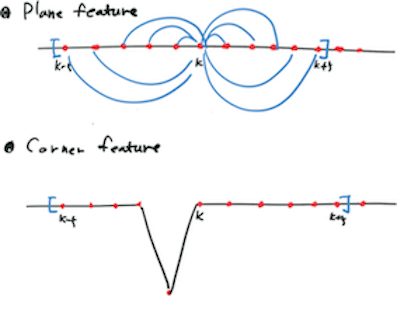

# scanRegistaration.cpp

## removeClosedPointCloud

```cpp
void removeClosedPointCloud(const pcl::PointCloud<PointT> &cloud_in, pcl::PointCloud<PointT> &cloud_out, float thres);
```

* 입력 point cloud 중 거리가 threshold 이하인 point를 제거하는 함수

### Details

1. input 과 output의 크기를 비교하여 같지 않으면 cloud\_out의 크기를 cloud\_in의 크기에 맞춘다.
2. cloud\_in의 크기 동안 길이의 제곱이 thres의 제곱보다 크면 clout\_out에 넣고 아니면 넣지 않는다.
3. 2를 수행할 결과, 길이가 cloud\_in과 다르면 resize를 해준다.
4. cloud\_out의 나머지 속성을 설정한다.
   * `height` = 1, `is_dense` = true,  `width` = `cloud_out`의 사이즈

## laserCloudHandler

```cpp
void laserCloudHandler(const sensor_msgs::PointCloud2ConstPtr &laserCloudMsg);
```

* 라이다의 point cloud 메세지를 받아서 처리하는 함수

### Details

1. `systemInited` 플래그를 체크한다.
   * ture이면, 그냥 진행한다.
   * * 그것이 systemDelay보다 커지면 systemInited 플래그를 true로 설정한다.
2. `laserCloudMsg`를 받아서 `laserCloudIn`에 넣고 전처리를 한다.
   * `laserCloudIn`에 `laserCloudMsg`를 넣어주고 NaN은 제거한다.
   * `removeClosedPointCloud` 함수를 수행해서 가까운 점들은 제거한다.
3. `startOri` (시작 포인트의 수평 각도)와 `endOri` \(마지막 포인트의 수평 각도\)를 설정한다.
4. `laserCloudIn`의 데이터를 scan별로 구분하여 처리하는 루프를 수행한다.
   * `laserCloudIn`에서 각 point마다 pitch를 계산하고 이것을 이용해 scanID를 부여한다.
   * point의 Ori \(수평각도\)를 계산하고 각 scan에서 절반을 지났는지\(``halfPassed`\) 아닌지 판단한다.
5. 각 scan 별로 `startIndex`와 `endIndex`를 찾는다.
6. 주변 10개의 데이터를 이용하여 각 point에서 curvature 계산한다.
   * 주변 10개의 point와 현재 point의 각 축 방향으로의 위치 차이를 합한 후 제곱하여 더한다.
7. 각 scan 별로 데이터를 6개의 영역으로 구분하고, 그 영역 내에서 curvature를 sorting한다.
8. curvature가 큰 것에서 작은 것으로 가면서 조건에 맞추어 `push\_back`을 한다. \(Corner 판단\)
   * 그 point가 not-picked이고 curvature가 0.1보다 큰지 판단한다.
     * 맞으면, `largestPickedNum`을 증가시킨다.
     * curvature가 가장 큰 2개는 `cornerPointsSharp`에 push-back한다.
     * curevature가 가장 큰 20개는 `cornerPointsLessSharp`에 push-back을 한다.
     * 현재 점의 `cloudNeighborPicked`를 1로 설정한다.
   * 현재 점 주변의 10개 point에 대해서 연속되는 점의 거리 차이의 제곱이 0.05보다 작으면, 그 점의 `cloudNeighborPicked`를 1로 설정한다.
9. curvature가 작은 것에서 큰것으로 가면서 조건에 맞추어 push-back을 한다. \(Plane 판단\)
   * 그 point가 not-picked이고 curvature가 0.1보다 작은지 판단한다.
     * 맞으면, `smallestPickedNum`을 증가시킨다.
     * curvature가 가장 큰 2개는 `surfPointsFlat`에 push-back한다.
     * curevature가 가장 큰 20개는 `surfPointsLessFlat`을 push-back을 한다.
     * 현재 점의 `cloudNeighborPicked`를 1로 설정한다.
   * 현재 점 주변의 10개 point에 대해서 연속되는 점의 거리 차이의 제곱이 0.05보다 작으면, 그 점의 `cloudNeighborPicked`를 1로 설정한다.
10. pcl데이터를 Ros Msg로 출력한다.
    * 코너 포인트 `cornerPointSharp`, `cornerPointLessSharp`
    * 평면 포인트 `flatPointSharp`, `flatPointLessSharp`



## main

```cpp
int main(int argc, char **argv);
```

* ROS message를 구독하고 이를 처리하여 출력한다.
  * ROS subscribe\(\)
    * /velodyne\_cloud\_2
  * ROS advertise\(\)
    * /laser\_cloud\_sharp
    * /laser\_cloud\_less\_sharp
    * /laser\_cloud\_flat
    * /laser\_cloud\_less\_flat
    * /lasser\_remove\_points
    * /laser_scanid_{i}
      * 스캔 별로 데이터를 publish한다.
* parameter
  * `scan_line`: 16
  * `minimum_range`: 0.1

