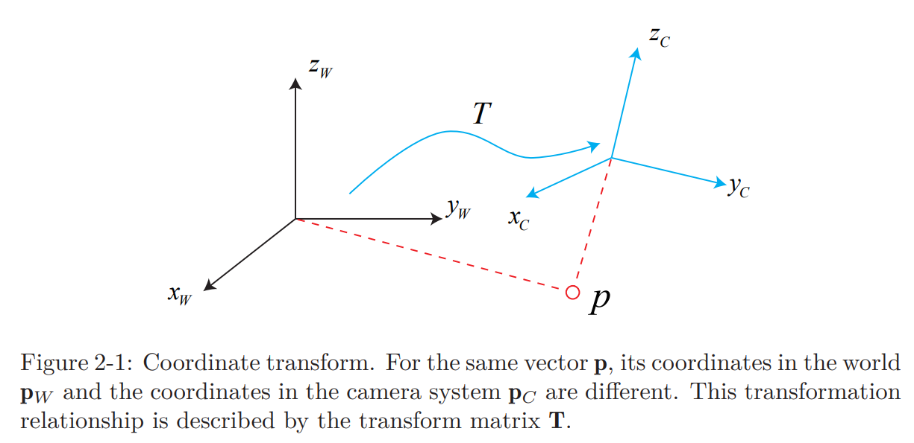

# 3D Rigid Body Motion
> **Goal of Study**
> 1. 3차원 공간 상의 강체 기하학(회전 행렬, 이동 행렬, 쿼터니온, 오일러 각)에 대해 학습
> 2. `Eigen Library`과 기하학 모듈의 사용법에 대해 학습

* 3차원 공간 상의 강체의 운동은 어떻게 기술하는 방법에 대해 학습
* 회전(rotation)을 다루기 위한 회전 행렬, 쿼터니온(quaternions), 오일러 각(Euler angle)에 대해 소개
* 계산을 위한 선형 대수 라이브러리인 Eigen을 활용한 실습 진행

## 회전 행렬(Rotation Matrix)
### 점, 벡터, 그리고 좌표계(Points, Vectors, and Coordinate Systems)
* 3차원 공간 상의 점은 3개의 좌표로 구체
* 강체(Rigid body)의 경우 *위치*와 *회전*을 고려
* 점은 공간의 기본 요소로써 길이와 부피가 없음
* 벡터는 두개의 점을 연결한 화살표
* 3차원 공간은 $\mathbb{R}^3$로 나타낼 수 있고, 베이스는 $\begin{pmatrix} \mathbf{e}_1 & \mathbf{e}_2 & \mathbf{e}_3 \end{pmatrix}$로 나타냄
* 벡터 $\mathbf{a}$의 좌표는 아래와 같이 나타낼 수 있음
  $$\begin{equation}
  \mathbf{a} = \begin{bmatrix} \mathbf{e}_1 & \mathbf{e}_2 & \mathbf{e}_3 \end{bmatrix} \begin{bmatrix} a_1 \\ a_2 \\ a_3 \end{bmatrix} = a_1 \mathbf{e}_1 + a_2 \mathbf{e}_2 + a_3 \mathbf{e}_3 
  \end{equation}$$
* $ \mathbf{a}, \mathbf{b} \in \mathbb{R}^3$인 경우의 내적(inner product)과 외적(outer product)의 정의
  $$\begin{equation}
  \mathbf{a} \cdot \mathbf{b} = \mathbf{a}^T\mathbf{b} = \sum_{i=1}^{3}{a_i}{b_i} = \vert\mathbf{a}\vert\vert\mathbf{b}\vert\cos{\langle\mathbf{a}, \mathbf{b}\rangle}
  \end{equation}$$
  $$\begin{equation}
  \mathbf{a} \times \mathbf{b} = \begin{Vmatrix}\mathbf{e}_1 & \mathbf{e}_2 & \mathbf{e}_3 \\ a_1 & a_2 & a_3 \\ b_1 & b_2 & b_3\end{Vmatrix} = \begin{bmatrix}{a_2}{b_3}-{a_3}{b_2}\\{a_3}{b_1}-{a_1}{b_3}\\{a_1}{b_2}-{a_2}{b_1}\end{bmatrix} = \begin{bmatrix}0 & -a_3 & a_2 \\ a_3 & 0 & -a_1 \\ -a_2 & a_1 & 0 \end{bmatrix} \mathbf{b} \overset{\Delta}{=} \mathbf{a}^{\wedge}\mathbf{b}
  \end{equation}$$
  $$\begin{equation}
  \mathbf{a}^{\wedge} = \begin{bmatrix}0 & -a_3 & a_2 \\ a_3 & 0 & -a_1 \\ -a_2 & a_1 & 0 \end{bmatrix} (Skew-symmetric matrix)
  \end{equation}$$
  
  ### 좌표계간의 유클리드 변환(Euclidean Transformation Between Coordinate Systems)
* World 좌표계 $\mathbf{p}_w = \left(x_W, y_W, z_W\right)$에서 카메라 좌표계 $\mathbf{p}_c = \left(x_C, y_C, z_C\right)$로의 변환 행렬 $\mathbf{T}$
  
* 이러한 변화를 강체 운동(rigid body motion)이라 함
  * 카메라의 움직임은 각 좌표계에서 길이와 각도가 변하지 않도록 하는 강체 운동 (유클리드 변환, Euclidean Transformation)
  * 두 좌표계간의 좌표의 정의
    * 단위 직교 베이스 $\begin{pmatrix} \mathbf{e}_1 & \mathbf{e}_2 & \mathbf{e}_3 \end{pmatrix}$
    * 회전 후 단위 직교 베이스 $\begin{pmatrix} \mathbf{e}_1' & \mathbf{e}_2' & \mathbf{e}_3' \end{pmatrix}$
    $$\begin{equation} \begin{bmatrix} \mathbf{e}_1 & \mathbf{e}_2 & \mathbf{e}_3 \end{bmatrix}\begin{bmatrix}a_1\\a_2\\a_3\end{bmatrix} = \begin{bmatrix} \mathbf{e}_1' & \mathbf{e}_2' & \mathbf{e}_3' \end{bmatrix}\begin{bmatrix}a_1'\\a_2'\\a_3'\end{bmatrix}\end{equation}$$
    * 두 좌표 사이의 관계를 설명하기 위해 (5)의 양 변에 $\begin{bmatrix} \mathbf{e}_1 & \mathbf{e}_2 & \mathbf{e}_3 \end{bmatrix}^T$ 곱함 (좌변의 베이스 행렬이 사라지는 것은 베이스 행렬의 크기는 1이고, 각 베이스는 직각을 이루기 때문)
        $$\begin{equation}
        \begin{bmatrix}a_1\\a_2\\a_3\end{bmatrix} = \begin{bmatrix} \mathbf{e}_1^T\mathbf{e}_1' & \mathbf{e}_1^T\mathbf{e}_2' & \mathbf{e}_1^T\mathbf{e}_3'\\\mathbf{e}_2^T\mathbf{e}_1' & \mathbf{e}_2^T\mathbf{e}_2' & \mathbf{e}_2^T\mathbf{e}_3'\\\mathbf{e}_3^T\mathbf{e}_1' & \mathbf{e}_3^T\mathbf{e}_2' & \mathbf{e}_3^T\mathbf{e}_3'\\ \end{bmatrix}\begin{bmatrix}a_1'\\a_2'\\a_3'\end{bmatrix}\overset{\Delta}{=}\mathbf{R}\mathbf{a}'\
        \end{equation}$$
    * 행렬 $\mathbf{R}$은 회전 행렬
* 회전 행렬의 속성
    * 행렬식의 값이 1인 직교 행렬
        $$ 
        \begin{equation}
        \mathbf{SO}(n) = \left\{
            \mathbf{R} \in \mathbb{R}^{n\times n} \vert 
            \mathbf{R} \mathbf{R}^T = \mathbf{I}, 
            \det\left(\mathbf{R}\right) = 1
             \right\}
        \end{equation}
        $$
    * $SO\left(n\right)$ 은 *special orthogonal group* ("group"은 다음 챕터에)
    * $SO\left(3\right)$ 은 3차원 공간 상에서의 회전
    * 회전 행렬은 직교(orthogonal)하기 때문에 역행렬(i.e. 전치행렬)은 반대방향 회전을 의미
        $$
        \begin{equation}
        \mathbf{a}' = \mathbf{R}^{-1}\mathbf{a} = \mathbf{R}^T\mathbf{a}
        \end{equation}
        $$
* 유클리드 변환(Euclidean transformation)은 회전과 이동을 포함
  $$
  \begin{equation}
  \mathbf{a}' = \mathbf{R}\mathbf{a} + \mathbf{t}
  \end{equation}
  $$
    * 여기서 $\mathbf{t}$는 이동 벡터
    * 2번 좌표계에서 1번 좌표계로의 변환은 아래와 같이 표현
      $$
      \begin{equation}
      \mathbf{a}_1 = \mathbf{R}_{12}\mathbf{a}_2 + \mathbf{t}_{12}
      \end{equation}
      $$
    * 반대 방향으로의 변환을 $\mathbf{R}_{12}$, $\mathbf{t}_{12}$로 표현하면 아래와 같음
      $$
      \begin{aligned}
      \mathbf{R}_{12}\mathbf{a}_2 &= \mathbf{a}_1 - \mathbf{t}_{12}\\
      \mathbf{a}_2 &= \mathbf{R}_{12}^T\left(\mathbf{a}_1 - \mathbf{t}_{12}\right)\\
      \mathbf{a}_2 &= \mathbf{R}_{12}^T\mathbf{a}_1 - \mathbf{R}_{12}^T\mathbf{t}_{12}
      \end{aligned}
      $$
    * 회전의 경우 $\mathbf{R}_{21} = \mathbf{R}_{12}^T$ 이지만, 
    * 이동의 경우 $\mathbf{t}_{21} = -\mathbf{R}_{12}^T\mathbf{t}_{12} \neq -\mathbf{t}_{12}$ 

### 변환 행렬과 동차 좌표계(Transformation Matrix and Homogeneous Coordinate)
* $\mathbf{R}_1, \mathbf{t}_1$ 과 $\mathbf{R}_2, \mathbf{t}_2$ 를 이용한 두개의 변환
    $$
    \mathbf{b} = \mathbf{R}_1\mathbf{a} + \mathbf{t}_1
    \mathbf{c} = \mathbf{R}_2\mathbf{b} + \mathbf{t}_2
    $$
  에 대해서 $\mathbf{a}$에서 $\mathbf{c}$로의 변환은 다음과 같음
    $$
    \mathbf{c} = \mathbf{R}_2\left(\mathbf{R}_1\mathbf{a} + \mathbf{t}_1\right) + \mathbf{t}_2
    $$
* 변환 식을 좀 더 단순화 하면 다음과 같음
    $$
    \begin{equation}
    \begin{bmatrix}\mathbf{a}' \\ 1\end{bmatrix} = 
    \begin{bmatrix}\mathbf{R} & \mathbf{t} \\ \mathbf{0}^T & 1\end{bmatrix}\begin{bmatrix}\mathbf{a} \\ 1\end{bmatrix} \overset{\Delta}{=}
    \mathbf{T}\begin{bmatrix}\mathbf{a} \\ 1\end{bmatrix}
    \end{equation}
    $$
* 3차원 벡터의 끝에 하나의 차원을 추가하여 **동차 좌표계**라 불리는 4차원의 벡터로 변환하는 수학적 트릭을 사용
* $\mathbf{T}$는 변환 행렬
* 임시로 $\mathbf{a}$의 동차 좌표계를 $\tilde{\mathbf{a}}$로 쓰면 다음과 같이 간단히 식을 표현
    $$
    \begin{equation}
    \begin{matrix}
    \tilde{\mathbf{b}} = \mathbf{T}_1\tilde{\mathbf{a}},& 
    \tilde{\mathbf{c}} = \mathbf{T}_2\tilde{\mathbf{b}} &\Rightarrow&
    \tilde{\mathbf{c}} = \mathbf{T}_2\mathbf{T}_1\tilde{\mathbf{a}}
    \end{matrix}
    \end{equation}
    $$
* 동차 좌표계를 표현할 때 특별히 문제가 없다면 간단히 $\mathbf{b} = \mathbf{T}\mathbf{a}$로만 표현
* 변환 행렬 $\mathbf{T}$는 좌상단은 회전 행렬, 우상단은 이동 행렬, 좌하단은 $\mathbf{0}$행렬, 우하단은 1인 특별한 구조를 갖고 있음
* 이를 *Special Euclidean Group* 이라 부르고 아래와 같이 씀
    $$
    \begin{equation}
    SE\left(3\right) = \left\{\mathbf{T} = 
    \begin{bmatrix}\mathbf{R} & \mathbf{t} \\ \mathbf{0}^T & 1\end{bmatrix} \in \mathbb{R}^{4\times4} \vert \mathbf{R} \in SO\left(3\right), \mathbf{t} \in \mathbb{R}^3\right\}
    \end{equation}
    $$
* 이에 대한 역행렬은 다음과 같이 쓸 수 있음
    $$ 
    \begin{equation}
    \mathbf{T}^{-1} = \begin{bmatrix}\mathbf{R}^T & -\mathbf{R}^T\mathbf{t} \\ \mathbf{0}^T & 1\end{bmatrix}
    \end{equation}
    $$