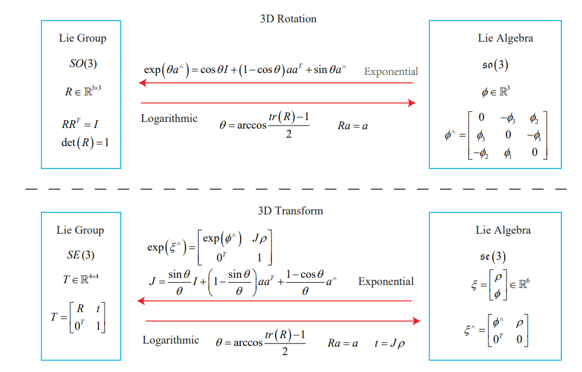

# Lie Group and Lie Algebra

#### 왜 배우는가?

#### 목적: 최적화 문제의 단순화

- 3D SLAM 문제는 비선형최적화를 통해 optimal camera pose **T**=[**R**|**t**]를 찾는 과정이 필요.
- Rotation matrix **R**의 특징(orthogonal, determinant=1) 때문에 제약조건이 있는 최적화 문제로 구성이 되어 풀기가 어려움.
- Lie Group과 Lie Algebra 간의 변환 관계를 이용하면, 제약조건이 없는 최적화 문제로 보다 쉽게 풀이가 가능.

#### Table of contents

1. [Basics of Lie Group and Lie Algebra](#Basics of Lie Group and Lie Algebra)
2. [Exponential and Logarithmic Mapping](#Exponential and Logarithmic Mapping)
3. Lie Algebra Derivation and Perturbation Model

## Basics of Lie Group and Lie Algebra

#### 무엇인가?

#### 1. Group의 정의

**집합과 연산으로 구성된 대수적 구조**로 아래의 그룹 공리(group axiom)를 만족해야한다.
$$
\forall a_{1}, a_{2} \in A, a_{1} \cdot a_{2} \in A \\
\forall a_{1}, a_{2}, a_{3} \in A,\left(a_{1} \cdot a_{2}\right) \cdot a_{3}=a_{1} \cdot\left(a_{2} \cdot a_{3}\right) \\
\exists a_{0} \in A, s.t. \forall a \in A, a_{0} \cdot a=a \cdot a_{0}=a \\
\forall a \in A, \exists a^{-1} \in A, st\; a \cdot a^{-1}=a_{0}
$$

각각은 닫힘성, 결합법칙, 항등원, 역원을 의미한다. 

#### 2. Lie Group

- 위의 axiom을 만족하는 Group 중 노르웨이의 수학자 Sophus Lie의 이름을 붙인 group.

  - 여기서는 SLAM 문제 해결이 목적이므로, Lie Group 중에서도 3D rigid body motion과 관련된 SO(3), SE(3)를 다룬다. 

  $$
  \begin{gathered}
    \operatorname{SO}(3)=\left\{\mathbf{R} \in \mathbb{R}^{3 \times 3} \mid \mathbf{R R}^{T}=\mathbf{I}, \operatorname{det}(\mathbf{R})=1\right\} \\
    \mathrm{SE}(3)=\left\{\mathbf{T}=\left[\begin{array}{cc}
    \mathbf{R} & \mathbf{t} \\
    \mathbf{0}^{T} & 1
    \end{array}\right] \in \mathbb{R}^{4 \times 4} \mid \mathbf{R} \in \operatorname{SO}(3), \mathbf{t} \in \mathbb{R}^{3}\right\}
    \end{gathered}
  $$
  - SO(3)는 (집합**R**, 행렬 곱), SE(3)는 (집합**T**, 행렬 곱) 으로 구성된 Group. 
  $$
  \mathbf{R}_{1}+\mathbf{R}_{2} \notin \mathrm{SO}(3), \quad \mathbf{T}_{1}+\mathbf{T}_{2} \notin \mathrm{SE}(3)\\
    
    \mathbf{R}_{1} \mathbf{R}_{2} \in \mathrm{SO}(3), \quad \mathbf{T}_{1} \mathbf{T}_{2} \in \mathrm{SE}(3)
  $$
- smooth(미분 가능)한 특징을 가짐.

- 복잡한 비선형 공간이나 국소적 선형으로 벡터공간 대수를 사용가능.

Tangent Space(접선 공간) 예시

Lie Group의 Tangent Space상에서 Lie Algebra(후에 설명)가 적용된다

이미지 출처: https://en.wikipedia.org/wiki/Tangent_space

#### 3. Lie Algebra

- Lie Group의 Local Structure를 기술. (즉, Lie Group의 Tangent Space)

- 따라서, 각 Lie Group에 대응되는 Lie Algebra(대수학적 풀이/표현 방법)가 존재.

  - 이를 이용하여, SLAM의 최적화 문제를 제약조건 없이 효율적으로 풀이 가능.

  $$
  \min _{\mathbf{T}} J(\mathbf{T})=\sum_{i=1}^{N}\left\|\mathbf{z}_{i}-\mathbf{T}\mathbf{p}_{i}\right\|_{2}^{2}
  $$

SLAM 최적화 문제 예시

위의 Transformation을 SE(3)에 대해 풀이하기 위해서는 제약조건이 필요.

- Lie Algebra 중, 3D rigid body motion과 관련된  so(3), se(3) 요소는 다음과 같이 표현.
  - Lie Group의 SO(3), SE(3)와 대응되며 각각 3D rotation과 3D transformation(rotation + translation)을 나타낸다.

$$
\mathfrak{s o}(3)=\left\{\boldsymbol{\phi} \in \mathbb{R}^{3} \text { or } \boldsymbol{\Phi}=
  \boldsymbol{\phi}^{\wedge}=\left[\begin{array}{ccc}
  0 & -\phi_{3} & \phi_{2} \\
  \phi_{3} & 0 & -\phi_{1} \\
  -\phi_{2} & \phi_{1} & 0
  \end{array}\right] \in \mathbb{R}^{3 \times 3}\right\}
$$

$$
\mathfrak{s e}(3)=\left\{\boldsymbol{\xi}=\left[\begin{array}{l}
\boldsymbol{\rho} \\
\boldsymbol{\phi}
\end{array}\right] \in \mathbb{R}^{6}, \boldsymbol{\rho} \in \mathbb{R}^{3}, \boldsymbol{\phi} \in \mathfrak{s o}(3), \boldsymbol{\xi}^{\wedge}=\left[\begin{array}{cc}
\boldsymbol{\phi}^{\wedge} & \boldsymbol{\rho} \\
\mathbf{0}^{T} & 0
\end{array}\right] \in \mathbb{R}^{4 \times 4}\right\}
$$

## Exponential and Logarithmic Mapping

#### Lie Group과 Lie Algebra의 관계
앞에서 **Lie Group은 비선형 공간**이며 **Lie Algebra는 이에 대응되는 Tangent Space**에서 적용됨을 개념적으로 설명하였다. 
이 절에서는 둘 사이의 수학적 관계식을 유도해보고 이해~~(또는 받아들인다...)~~하는 것을 목적으로 한다.

(우리의 목표는 Lie Algebra를 도입해서 효율적으로 SLAM 최적화 문제를 해결하는 것이기 때문에, 
그 풀이에 앞서 Lie Group과의 대응관계를 유도하고, Lie Algebra로 문제를 바꿔서 풀어도 된다는 믿음?을 얻는 과정이다.)
