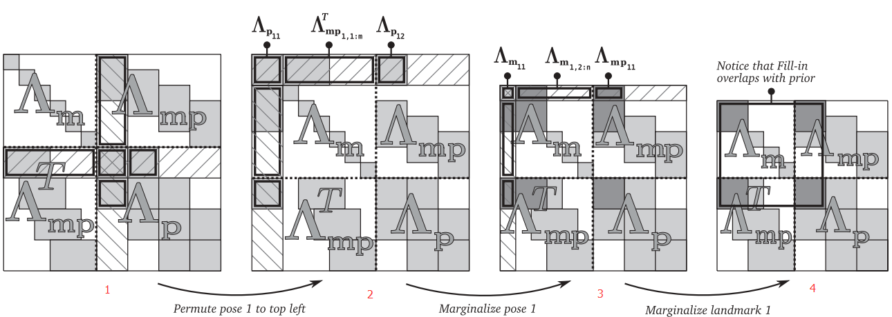
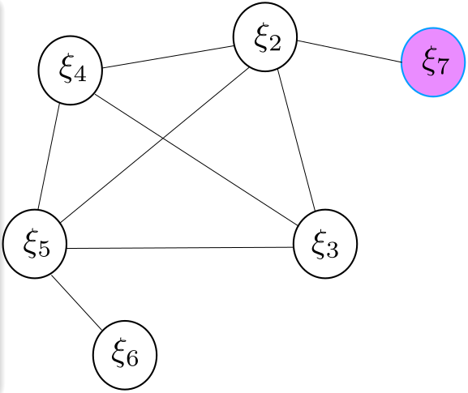

# Marginalization

많은 그래프 최적화 기반의 SLAM기법에서 주변화 (marginalization)는 그래프 크기의 증가를 제어해서 실시간 성능을 얻기 위해 사용되고 있다. 하지만, 많은 논문들이 그냥 주변화를 했다고 언급만 하고 지나가고 어떻게 했는지에 대해서는 자세히 언급하고 있지 않다. 몇몇 논문들 (sliding window slam [^2], okvis [^3], dso [^4])은 주변화에 특별한 기법을 적용하여 성능을 개선하였다고 주장하기도 한다.  하지만 이 개념을 이해하고 응용하는 것은 중요하다.

SLAM에서 주변화는 다음의 두가지 목적으로 주로 사용된다.

1. 카메라 포즈와 랜드마크로 구성된 최적화 추정을 할 때, 연산 속도의 증가
   - 헤시안 행렬의 sparsity 특성을 이용해 상대적으로 크기가 큰 랜드마크를 주변화하고 카메라 포즈를 구한 후, 이것을 이용해 랜드마크를 구하는 식으로 연산 속도를 개선하기 위해 사용한다.
1. 그래프의 크기를 유지함.
   - 더 이상 유효하지 않은 변수를 주변화해서 그래프에서 삭제함으로써, 그래프의 크기를 어느 정도 일정하게 유지함. 이를 통해 최적화 변수의 개수를 제한함으로써 연산량이 증가하는 것을 억제함.

## Basics

우리는 확률 이론을 배우면서 주변화의 개념을 배운다. 확률변수 $$x, y$$의 결합분포 (joint distribution) $$p(x,y)$$에서 $$x$$의 distribution $$p(x)$$을 구하는 것이 우리가 배운 주변화이다. 즉, 여러 확률 변수의 결합분포에서 우리가 관심있는 확률변수들 만의 결합 분포를 추출하는 것이다.

이것을 SLAM의 Bundle Adjustment에 적용해보자. 카메라 포즈와 랜드 마크는 다른 지역을 돌아다닌다고 가정하면 시간이 지남에 따라 증가하게 된다. 따라서 최적화할 변수도 증가하게 되고 이는 아무리 BA의 $$H$$ 행렬이 희박성을 가진다고 해도  실시간 연산의 제약을 가져온다. 따라서 실시간 연산 능력을 확보하기 위해서는 최적화 변수를 하드웨어가 다룰 수 있는 한계 내로 제약해야 한다. 하지만 어떤 변수를 어떻게 제거해야 성능의 저하를 최소화할 수 있을까? 예를 들어 키프레임 1부터 키프레임 N까지의 카메라 포즈와 랜드 마크를 다루는 상황에서 새 키프레임을 추가한다고 가정해보자. 이 때, 키프레임 1과 관련된 모든 변수들을 제거해버리면 그만일까?

Gabe Sibley [^2]는 그의 논문에서 단순히 최적화 변수를 삭제하는 것은 그와 관련된 모든 정보들을 잃는 것을 의미하며, 그것은 삭제한 최적화 변수와 결합 분포를 가지고 있는 나머지 변수들의 추정에도 영향을 미치게 된다고 이야기했다. 왜냐하면 삭제된 변수와의 결합분포로 설정되어 있던 constraint가 사라지기 때문이다. 따라서 변수들을 삭제하기 위해서는 다변수 가우시안 분포에 기반해서 적절한 주변화를 수행해야 한다.

그럼 주변화는 어떻게 할까? 대부분의 경우, Schur complement를 이용한다. 그래프 최적화 문제 혹은 BA는 가우시안 분포를 가정할 때, least square 문제로 정리할 수 있다. 이것은 다음의 최소화 문제을 푼 것이다.
$$
\begin{align}\mathbf{F}(\mathbf{x}) &= \sum_{<i, j>\in\mathcal{C}}\underbrace{\mathbf{e}(\mathbf{x}_i,\mathbf{x}_j,\mathbf{z}_{ij})^T\boldsymbol{\Omega}_{ij}\mathbf{e}(\mathbf{x}_i,\mathbf{x}_j,\mathbf{z}_{ij})}_{\mathbf{F}_{ij}}\\
\mathbf{x}^{*} &= arg\min_{\mathbf{x}}\mathbf{F}(\mathbf{x})
\end{align}
$$

일반적으로 포즈 그래프나 BA에서는 오차 함수 $$e$$ 는 비선형이다. 비선형 최소제곱 문제의 해는 다음과 같다.
$$
\begin{align}
\mathbf{H}\Delta\mathbf{x} &= -\mathbf{b}\\
\mathbf{H} &= \mathbf{J}^T\mathbf{W}\mathbf{J}\\
\mathbf{b} &= \mathbf{J}\mathbf{W}\mathbf{e}
\end{align}
$$
여기서, $$\mathbf{J}$$ 는 선형화지점에서 구한 오차의 자코비안이며, $$\mathbf{W}$$ 는 가중치 대각 행렬이다.

SLAM 문제에서는 $$\mathbf{H}$$가 sparse 행렬이므로 Schur complement을 이용하여 연산속도를 향상시킬 수 있다. 하지만 여기서는 그 sparse한 구조와 상관없이 주변화할 변수들과 남길 변수들에 대하여 생각해보기로 한다. 현재의 변수를 주변화하지 않을 변수 $$\mathbf{x}_r$$ 와 주변화할 변수 $$\mathbf{x}_m$$ 으로 구분하면 위의 식은 다음과 같이 블록화할 수 있다.
$$
\begin{bmatrix} \mathbf{H}_m & \mathbf{H}_{mr}\\
\mathbf{H}_{mr}^T & \mathbf{H}_r
\end{bmatrix} 
\begin{bmatrix} \Delta\mathbf{x}_m\\ \Delta\mathbf{x}_r\end{bmatrix}
= \begin{bmatrix} -\mathbf{b}_m \\ -\mathbf{b}_r\end{bmatrix}
$$
위의 식을 주변화하기 위해서 변형하면 다음과 같다.
$$
\begin{bmatrix} \mathbf{H}_m & \mathbf{H}_{mr}\\
\mathbf{0} & \mathbf{H}_r - \mathbf{H}_{mr}^T \mathbf{H}^{-1}_m \mathbf{H}_{mr}
\end{bmatrix} 
\begin{bmatrix} \Delta\mathbf{x}_m \\ \Delta\mathbf{x}_r\end{bmatrix}
= \begin{bmatrix} -\mathbf{b}_m \\ -\mathbf{b}_r + \mathbf{H}_{mr}^T \mathbf{H}^{-1}_m \mathbf{b}_m \end{bmatrix}
$$
위의 식을  $$\Delta{x}_m$$과  관련된 식만 정리하면 다음과 같다. 
$$
\left(\mathbf{H}_r - \mathbf{H}_{mr}^T \mathbf{H}^{-1}_m \mathbf{H}_{mr}\right)\Delta\mathbf{x}_r = -\mathbf{b}_r + \mathbf{H}_{mr}^T \mathbf{H}^{-1}_m \mathbf{b}_m
$$
위의 식을 이용해서 $$\Delta\mathbf{x}_r$$ 을 구할 수 있다. 비선형 최소 제곱문제를 풀 때는 주변화하지 않는 변수만을 업데이트하면서 반복적으로 갱신한다. 위와 같이 새 변수들을 추가되면 지속적으로 오래된 변수는 주변화하여 일정 수준의 연산량을 유지하도록 한다. 물론 원한다면 주변화될 변수도 계산하여 업데이트할 수도 있다. 최적화 변수들이 다변수 가우시안 확률분포를 가진다면 주변화를 한다는 것은 결국 주변화할 변수들이 주어졌을 때, 주변화하지 않는 변수들의 조건부 확률분포를 구하는 것과 같다.

### Note

g2o나 orb-slam에서 카메라 포즈는 주변화하지 않는 변수, 랜트마크는 주변화할 변수로 생각하여 계산하지만 실제로는 모두 다 업데이트를 해서 계산하고 포즈만 남기는 방식을 사용한다. 따라서 여기서 설명하는 주변화 개념과는 살짝 차이가 있다. 위의 설명만 보면 주변화는 매우 간단해보인다. 하지만 실제로 적용하려면 좀 어려운 부분이 많다. 실제로 다변수 가우시안 분포에서 주변화를 하는 경우, 공분산 행렬은 잘 분할되어도 정보 행렬은 잘 분할되지 않는다. SLAM이나 BA에서는 공분산보다는 $$\mathbf{H}$$ 행렬을 이용하는데 schur complement는 $$\mathbf{H}$$ 행렬의 분할을 위해 필요하다.

## Details

위의 설명만 보면 매우 간단하지만, [^2]는 주변화에 대한 좀 더 구체적인 분석을 제시했다. $$\mathbf{H}$$ 행렬의 sparse 특성을 유지하기 위해서는 [^2]에서 분석한 몇 가지 테크닉들을 적용해야 한다. SLAM에서 $$\mathbf{H}$$ 행렬의 구조는 아래의 그림과 같다.

좌측상단의 대각 행렬은 카메라 포즈에 대한 블록이고 우측 하단의 대각행렬은 랜드마크에 대한 블록이다. 초록색 부분은 카메라 포즈와 랜드마크의 연관성에 의해 생성되는 블록이다. 만약 4개의 카메라 포즈와 6개의 랜드마크가 있는 경우를 생각해보자. 각 카메라 포즈에서 3개의 랜드마크가 관측된다고 가정한다. 카메라 포즈와 카메라 포즈 사이의 에지는 IMU 제약조건과 같은 상대 모션 제약 조건을 의미하고 카메라 포즈와 랜드 마크 사이의 에지는 카메라 관측 제약 조건을 의미한다.

여기서, 카메라 포즈 1과 랜드마크 1을 주변화한다고 생각해보자. 그 때, 헤시안 행렬이 어떻게 변하는지 확인해보자.

위의 그림 중, 가장 왼쪽에 위치한 그림 1은 원본 헤시안 행렬이다. (논문에서 가져온 그림이기 때문에 위에 설명한 수식의 상태변수 배치와는 다르다. 여기서는 카메라 포즈가 아래에 위치하고 랜드마크가 위에 위치한다.) 카메라 포즈 1과 관련된 부분은 빗금으로 표시되어 있다. 단순히 행렬 블록의 위치가 변경된 것으로 보면 된다. 그림 2는 카메라 포즈 1과 관련된 부분이 가장 왼쪽의 외곽으로 이동시킨 결과이다. 그리고 이를 이용해서 카메라 포즈 1과 관련된 부분을 주변화하면 그림 3의 헤시안 행렬이 된다. 그림 3에서 볼 수 있듯이, 주변화하는 변수와 연관되어있던 블록이 주변화되면서 랜드마크 블록에서 카메라 포즈 1과 관련되어 있던 부분들이 sparse 행렬이 아니라 dense 행렬이 된다. 이것은 그림 상에서 어두운 색의 블록으로 표현되어 있다. 이 과정을 그래프로 표현하면 다음 그림과 같다.

여기서 랜드마크 1, 2, 3과 카메라 포즈 1이 연관되어 있음을 기억하자. 카메라 포즈 1이 주변화되면서 원래는 연관성이 없던 랜드마크 1, 2, 3이 연관관계를 가지게 됨을 그래프를 통해서 확인할 수 있다. 거기에 더해서 원래 카메라 포즈 2와 연관이 없던 랜드마크 1, 2도 카메라 포즈 2와 연관관계를 가지게 됨을 볼 수 있다.

이제 추가로 랜드마크 1을 주변화해보자. 이미 관련된 모든 노드가 연관관계를 가지고 있었기 때문에 랜드마크 1을 주변화한다는 것은 단순히 랜드마크 1 노드 및 연관된 에지를 삭제하는 것임을 확인할 수 있다. 즉, 랜드마크 1이 주변화되면서 관련 행렬은 삭제되고, 카메라 포즈 2와 랜드 마크 2, 3과 관련된 행렬의 값이 변화된다. 하지만, 새롭게 dense 요소가 생성되지는 않는다. 결국 카메라 포즈 1과 랜드마크 1을 주변화한 뒤의 그래프는 랜드 마크 2와 3사이에 원래 없었던 에지가 추가된 것임을 볼 수 있다.

### VINS-Mono’s two-way Marginalization Strategies

VINS-Mono는 새로 들어온 프레임이 키프레임인지 아닌지 여부에 따라 주변화 전략을 구분하여 수행한다. 시차 비교를 통하여 최신의 키프레임 $${KF}_n$$을 주변화하거나 가장 오래된 프레임 $${KF}_1$$을 주변화한다. 만약 최신의 프레임을 키프레임으로 추가하면 $${KF}_1$$이 주변화한다. $${KF}_1$$ 과 연관된 랜드마크와 포즈 에지는 prior information으로 변환되어 목적함수에 추가된다. 최신의 프레임이 키프레임이 아니면, 새 프레임을 주변화하는 것이 아니라 그냥 버린다. 그 이유는 최신의 프레임과 키프레임이 유사한 정보를 품고 있기 때문에 그냥 버린다고 해도 손실되는 정보가 크지 않다고 생각하기 때문이다.

### Consistency

주변화를 통해 시스템 고유의 특성이 깨지게 된다면, 추정치가 의도하지 않은 값을 가지게 될 수 있다. 결국 주변화를 할 때, 일관성 (Consistency)를 고려하는 것이 중요하다. 이것을 위해 dso [^5]나 okvis[^3]에서는 FEJ (First Estimate Jacobian)에 대하여 특별히 언급하였다. FEJ는 자코비안을 계산할 때, 선형화지점을 주변화 시점의 값으로 고정하는 것을 말한다.

#### FEJ(First Estimate Jacobian)

일반적으로 최적화를 수행할 때, iteration을 수행하면서 그때마다 갱신 값을 구하고 이를 이용하여 최적화 변수 값을 갱신한다. 이 때, 갱신할 때마다 선형화 지점이 변하기 때문에 자코비안 역시 갱신된 선형화지점에서 다시 계산한다. FEJ는 이렇게 매 iteration마다 자코비안을 갱신하지 않고 선형화 시작 시점의 값에서 계산한 자코비안을 고정하여 사용하는 것이다. 그 이유에 대해서는 [^7]에 잘 설명되어 있다.

위의 그림에서 에너지 함수 $$E$$ 는 서로 다른 비선형 에너지 함수 $$E_1$$ 과 $$E_2$$ 의 합으로 구성된다. 그림에서 볼 수 있듯이 $$E$$가 최소가 되는 지점은 $$xy =1$$ 이 된다. $$E_1$$을 $$(0.5, 1.4)$$ 에서 선형화를 통해 2차 근사된 것이 두번째 그림이다. 마찬가지로 $$E_2$$ 를 $$(1.2, 0.5)$$ 근처에서 선형화하여 2차 근사된 결과가 세번째 그림이다. 이 두 에너지 함수를 합해보면 원래의 함수와 차이가 큰 것을 확인할 수 있다. 이것은 두 함수를 서로 다른 선형화 지점에서 근사하기 때문이다. 서로 다른 선형화지점에서 선형화한 결과를 합치니 $$xy=1$$ 이라는 널 스페이스가 사라져서 (1, 1) 지점에서 해를 갖는 것처럼 되었다. 결과적으로 근사하기 전의 해는 고유하지 않지만 근사과정에서 널 스페이스가 사라지면서 고유한 해를 갖는 것으로 특성이 변형되어 불확실성이 사라지는것을 볼 수 있다. 이는 우리에게 잘못된 정보를 전달하고 이런 과정이 반복되면 추정치의 오차가 커진다.

이를 주변화와 연관시켜 생각해보자. 주변화할 변수를 아예 추정하지 않는 경우, 주변화하는 변수의 값은 갱신되지 않고 주변화하지 않을 변수들은 지속적으로 갱신된다. 하지만 주변화하지 않는 변수들의 선형화 지점과 주변화하는 변수들의 션형화 지점이 서로 달라지기 때문에 이 과정에서 에너지 함수의 고유한 특성이 사라질 수 있다. 따라서 이를 해결하기 위해서는 자코비안을 주변화 시작 시점에서 계산한 값으로 고정해야 위의 문제가 발생하지 않는다. (**Q: 하지만 자코비안과 선형화지점의 비정합이 발생하게 된다. 이에서 기인하는 선형화 오차와 고유특성 상실 사이의 trade-off가 있지는 않은가?**)

다음과 같이 6개의 카메라 포즈가 서로 에지로 연결되어 있다고 가정해보자.

카메라 포즈 사이의 연관 관계를 기반으로 포즈 그래프의 정보 행렬을 그려보면, 왼쪽 그림과 같다.  여기에서 카메라 포즈 1을 주변화해보자. 주변화하는 카메라 포즈 1과 관련된 정보 행렬의 요소들을 이용하여 남은 카메라 포즈들의 정보 행렬을 계산하면 연관관계가 없던 카메라 포즈 2, 3, 4, 5 사이에 연관 관계가 생긴 것을 볼 수 있다. 

주변화 시점 ($$t_k$$) 부터 살펴보면, 
$$
b_p(k) = b_{\alpha}(k) - \Lambda_{\alpha\beta}\Lambda^{-1}_{\beta\beta}(k)b_{\beta}(k)\\
\Lambda_p(k) = \Lambda_{\alpha\alpha}-\Lambda_{\alpha\beta}\Lambda^{-1}_{\beta\beta}(k)\Lambda_{\beta\alpha}(k)
$$
이것을 이용해 포즈 갱신치를 구할 때, 자코비안은 주변화시작 시점의 것으로 고정시킨다. 

여기에 새로운 카메라 포즈 7이 추가되는 경우를 생각해보자. 카메라 포즈 7은 카메라 포즈 2와 연관 관계를 가지고 있다.

만약 새 포즈가 다음 그래프와 같이 추가되면, 정보행렬은 다음과 같이 변화한다. 정보 행렬은 아래의 그림과 같다. 새 카메라 포즈 7과 에지(카메라 포즈 2와 7 사이)가 추가되면서 정보행렬의 관련 요소가 갱신되는 것을 확인할 수 있다. $$\xi_2$$와 관련된 항에 주목해보자. 새로운 잔차 $$r_{27}$$ 와 기존의 정보 행렬을 prior information으로 생각하여 최소 제곱 문제를 생성해보면 다음과 같다.
$$
b(k^{*}) = \Pi^{T}J_{p}r_p(k^{*}) - J^T_{2,7}(k^{*})\Sigma^{-1}_{2,7}r_{2,7}(k^{*})\\
\Lambda(k^{*}) = \Pi^T\Lambda_p(k)\Pi + J^T_{2,7}(k^{*})\Sigma^{-1}_{2,7}J_{2,7}(k^{*})\\
\Pi = [I_{dim(J_p(k))},\ 0]
$$
여기서 $$\Lambda_p$$에서 카메라 포즈 2, 3, 4, 5는 주변화된 변수 카메라 포즈 1과 연관 관계를 가지고 있기 때문에 dense block을 생성한다. 하지만 카메라 포즈 6은 카메라 포즈 1과 직접적인 연관관계가 없기 때문에 관련된 block의 값이 변하지 않는다. 카메라 포즈 7이 추가되기 전에 현재의 구성으로 각 카메라 포즈를 업데이트하였다고 가정해 보자. 이제 카메라 포즈 7이 카메라 포즈 2와 연관 관계를 가지며 추가되었다. 이제 카메라 포즈 2와 7 사이에서 자코비안을 계산할 때 사용하는 선형화 지점은 업데이트된 카메라 포즈 2를 이용하기 때문에 주변화 시 사용한  카메라 포즈 2의 값과 다르게 된다. 다시 정리하면, 아래의 그림에서 $$\Lambda$$를 구할 때 사용한 카메라 포즈 2는 $$\Lambda_6$$를 구할 때 사용한 카메라 포즈 2와 다른 값이 된다. 따라서 $$\xi_2$$와 관련된 항은 $$\Lambda$$와 $$\Lambda_6$$에서 관련된 block의 합인데, 이것은 서로 다른 선형화 지점에서 계산된 값이 합해지게 된 것이다. 따라서 위에서 언급한 것처럼 에너지 함수의 특성을 변경하여 일관성 문제를 일으킬 수 있다. [[7]](Decoupled, Consistent Node Removal and　Edge Sparsification for Graph-based SLAM) 은 이러한 경우, 주변화할 변수와 그 변수와 연관된 Markov Blancket에 계산한 local MLE estimate을 선형화지점으로 고정하는 것이 전체 시스템의 (sub-) optimal 해라고 주장하고 있다. 따라서 주변화를 하기 전에 새 포즈를 추가한 후 계산하거나 아니면 새 포즈를 추가할 때, 자코비안을 이전 선형화 지점에서 계산해야 한다. (**Q: 선형화 오차가 크기않을까? **)

## Back Data

### Schur Complement

$$
\mathbf{M} = \begin{bmatrix} A & B \\ C & D
\end{bmatrix}
$$

위와 같이 분할된 행렬을 upper triangular 행렬 혹은 lower triangular 행렬로 만들 때, Schur Complement를 사용한다.
$$
\begin{align}
&\begin{bmatrix} I & 0 \\ -CA^{-1} & I
\end{bmatrix}
\begin{bmatrix} A & B \\ C & D
\end{bmatrix} = 
\begin{bmatrix} A & B \\ 0 & \Delta_A
\end{bmatrix}\\
&\begin{bmatrix} A & B \\ C & D
\end{bmatrix}
\begin{bmatrix} I & -A^{-1}B \\ 0 & I
\end{bmatrix}
 = \begin{bmatrix} A & 0 \\ C & \Delta_A
\end{bmatrix}\\
&\Delta_A = D-CA^{-1}B
\end{align}
$$
여기서 $$A$$ 는 invertable 행렬이어야 한다. $$\Delta_A$$ 는 $$A$$ 의 Schur Complement이다. 아래와 같은 연산으로 $$\mathbf{M}$$ 는 대각 행렬로 변환된다.
$$
\begin{bmatrix} I & 0 \\ -CA^{-1} & I
\end{bmatrix}
\begin{bmatrix} A & B \\ C & D
\end{bmatrix}
\begin{bmatrix} I & -A^{-1}B \\ 0 & I
\end{bmatrix}
 = \begin{bmatrix} A & 0 \\ 0 & \Delta_A
\end{bmatrix}\\
$$
분할되어 있는 행렬의 대각에 있는 $$A$$ 혹은 $$D$$ 가 invertable 행렬이면 원래의 행렬을 대각행렬로 변환할 수 있다. $$D$$를 이용하는 경우는 다음과 같다.
$$
\begin{bmatrix} I & -BD^{-1} \\ 0 & I
\end{bmatrix}
\begin{bmatrix} A & B \\ C & D
\end{bmatrix} = 
\begin{bmatrix} \Delta_D & 0 \\ C & D
\end{bmatrix}\\
\Delta_D = A - BD^{-1}C
$$
역으로 $$M$$ 행렬의 역행렬을 구하는데 Schur Complement를 다음과 같이 응용할 수도 있다.
$$
M=\begin{bmatrix} A & B \\ C & D
\end{bmatrix} = 
\begin{bmatrix} I & 0 \\ CA^{-1} & I
\end{bmatrix}
\begin{bmatrix} A & 0 \\ 0 & \Delta_A
\end{bmatrix}
\begin{bmatrix} I & A^{-1}B \\ 0 & I
\end{bmatrix}
$$

$$
M^{-1}=\begin{bmatrix} A & B \\ C & D
\end{bmatrix}^{-1} = 
\begin{bmatrix} I & -A^{-1}B \\ 0 & I
\end{bmatrix}
\begin{bmatrix} A^{-1} & 0 \\ 0 & \Delta^{-1}_A
\end{bmatrix}
\begin{bmatrix} I & 0 \\ -CA^{-1} & I
\end{bmatrix}
$$

다변수 가우시안 분포를 가지는 변수와 연관된 행렬을 Schur Complement로 분할하면 주변 분포 (marginal distribution)과 조건부 분포 (conditional distribution)이 된다.

## Reference

### Web
1. [Windowed Optimization in DSO](https://blog.csdn.net/heyijia0327/article/details/53707261)
1. [Marginalization and Schur complement in SLAM](https://blog.csdn.net/heyijia0327/article/details/52822104)
1. [Conditional and marginal distributions of a multivariate Gaussian](https://gbhqed.wordpress.com/2010/02/21/conditional-and-marginal-distributions-of-a-multivariate-gaussian/)

### Papers
[^1]:  g2o: A General Framework for Graph Optimization
[^2]: Sliding Window Filter with Application to Planetary Landing
[^3]: Keyframe-Based Visual-Inertial SLAM Using Nonlinear Optimization
[^4]: Direct Sparse Odometry
[^5]: Analysis and Improvement of the Consistency of Extended Kalman Filter based SLAM
[^6]: Motion Tracking with Fixed-lag Smoothing: Algorithm and Consistency Analysis
[^7]: Decoupled, Consistent Node Removal and　Edge Sparsification for Graph-based SLAM
