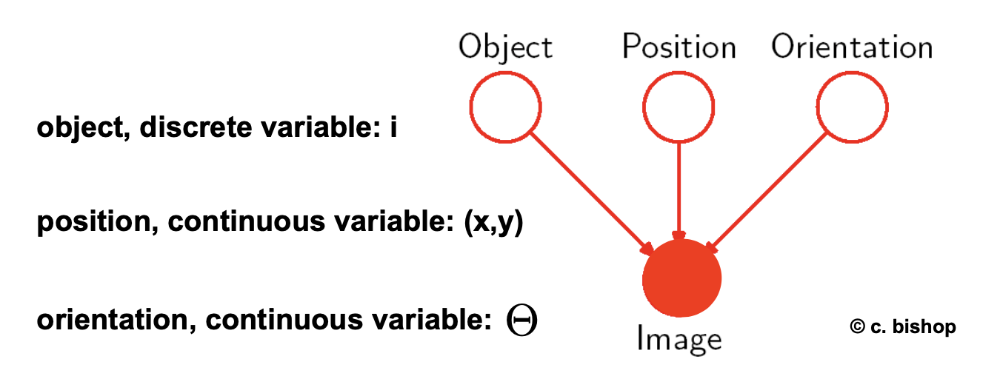

# 8. Backend 1

이 장에서는 SLAM의 벡엔드 최적화를 하는 방법에 대해서 공부하기로 한다.

## Inference Task

* Filtering
  * $P(X_t|z_{1:t})$
  
  * Bayes Filter
  
    
  
* Prediction
  * $P(X_{t+k}|z_{1:t})$ $0 < k$
  
* Smoothing
  * $P(X_t|z_{1:t})$ for $0 \leq k < t$
  
* Optimization
  * $arg \ max_{x_{1:t}}\  P(X_{1:t}|z_{1:t})$

## Graph-Optimization Approach

### Probabilistic Graphical Model

* 확률 변수 간의 연관 관계를 Graph로 표현한 것
* 새로운 모델을 디자인하는 프레임워크로 사용되며, SW를 통하여 효율적으로 구현될 수 있다.
  * Conditional Indepedence를 구하고 이에 기반한 factorization (decomposition)을 통해 모델링의 복잡도를 낮출 수 있음

### Graph Representation

* 노드 (N): state

* 에지 (E): 노드 간의 연관 관계의 의한 constraint를 표현

* 종류
  * Directed graph
    * Generativity나 Causality를 가진 시스템을 모델링하는데 유용함
    
    
    
    
    
    * D-seperation
    
      
    
      
    
  * Undirected graph
  
    *  상호간에 연관관계를 가지는 시스템을 디자인하는데 유용함.
  
    
  
  * Factor graph
    * Directed/Undriected graph를 일반화하여 에지를 factor (연관된 두 노드의 함수)로 모델링함.
  
      
  
    * Sum-Product Algorithm, message passing 등 일반적인 경우에 대한 Solution 존재함.
  
    * 다양한 분야에서 활용되고 있음.
  
    

## Kalman Filter as a Graph Model

## Factor-Graph based SLAM

### Block Diagram

* Front-End: 입력 센서의 데이터를 이용하여 구성한다.
  * Data Association 중요하다.
* Back-End: 비선형 최적화를 이용하여 graph-optimization을 수행한다.

### Pose Graph

* 노드: 로봇 포즈 (Pose: Position + Orientation)
* 에지: 노드 간 상대 포즈
* Cost Fuction: Mahalanobis distance between two poses

​	

* Front-End: 입력 센서의 데이터를 이용하여 Pose-Graph를 생성한다.
  * 사용하는 센서: Lidar, Camera, Radar
  
  * 에지 생성은 Temporal/Non-Temporal 경우가 있다.
    * Temporal 경우, IMU/WSS (Wheel Speed Sensor)에 의해서 에지가 생성된다.
    * Non-Temporal의 경우, 센서 측정치에서 동일한 특징을 인식하여 서로 간의 상대 포즈를 구한다. 이런 경우, 실제 센서 측정치로부터 구한 것이 아니므로 virtual measurement라고 한다.
    
  * Error Function Derivation
    
    
    
    * Why Manifold?
      * [From Least Squares to ICP [grisetti 16]](../reference/From Least Squares to ICP [grisetti 16].pdf)
  
* Back-End: Pose-Graph를 통하여 비선형 오차를 최소화한다.
  
  * Gauss-Newton Optimization을 수행한다.
  * Pose 간의 sparse한 연관관계에 의한 Sparsity를 이용하여 Real-time performance를 얻는다.
    * Sparsity of Hessian Matrix for Gauss-Newton Methods (Shur Complement)
    * Incremental matrix factorization and QR factorization(iSAM)

## Bundle Adjustment

* Feature-based Visual Odometry에서 자주 사용되는 방법으로 여러 대의 카메라 혹은 한 대의 카메라이지만 서로 다른 시간에 동일한 환경을 촬영하여 공통된 특징이 관측되는 경우, 이 공통된 특징 사이의 관계를 이용하여 카메라의 Pose 뿐만이 아니라 카메라에서 측정된 특징의 3차원 좌표까지 최적화를 한다.

 

* Robust 커널을 이용하여 추정의 강인성을 향상시킬 수 있다.
  * Outlier 혹은 잘못된 data association에도 잘 추정할 수 있어야 한다.
* [Graph-Based SLAM: A Least Squares Approach to SLAM using Pose Graphs [Cyrill]](../reference/Graph-Based SLAM_A Least Squares Approach to SLAM using Pose Graphs [Cyrill].pdf)

## 논문 (Least Squares Optimization/ From Theory to Practice)

