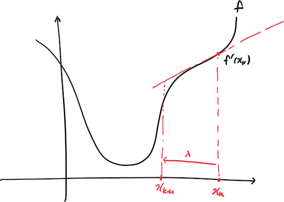

# 6. 비선형 최적화

이 장에서는 Bayesian theorem에 기반한 Maximum Likelihood (ML) 추정과 Maximum-a-posteriori (MAP) 추정에 대하여 학습하고, 이를 필터링 (Filtering) 방식과 수치 최적화 (Numerical optimization) 방식으로 구현하는 방법에 대해 알아본다.

필터링 방식은 Extended Kalman filter (EKF), Unscented Kalman filter (UKF)와 같은 칼만 필터 기반의 방식과 Particle Filter (PF)와 같은 Monte-Calro sampling에 기반한 방식이 있다. 수치 최적화 방식 같은 Non-linear least square, Gauss-Newton, Levenberg-Marquardt 방식이 있다. 또한 연속된 프레임만 비교하는 증분 처리 (Incremental) 방식과 모든 프레임 (혹은 키프레임)을 비교하는 일괄처리 (batch) 방식이 있다.

최신의 Visual-SLAM 알고리즘은 고가의 센서가 아닌 저가의 센서를 이용하여 정확한 Localization을 하는 것이 목적이며, 이를 위해서는 저가의 센서들로 부터 얻어진 노이즈가 큰 다수의 데이터로 부터 최적의 Localization을 수행하는 것이 중요하다. 최적의 추정은 확률적인 정보를 이용하여 수행되기 때문에 위에서 언급한 ML 혹은 MAP을 이용하여 수행한다. 적용되는 시스템에 따라 필터링 방식을 이용하는 경우도 있고, 수치 최적화를 하는 경우도 있지만, 현재까지의 측정치를 이용하여 현재의 최적 pose를 구하는데만 집중하는 Visual-Inertial Odometry (VIO)가 아니라면 대부분 수치 최적화 기법을 이용한다. 따라서 이 장에서는 수치 최적화에 기반한 비선형 최적화를 주로 다루기로 한다.

## 6.1. 상태추정 문제 (State Estimation Problem)

### Bayes Theorem

$$
p(x,y|z,u)= \frac{p(z,u|x,y)p(x,y)}{p(z,u)} \propto p(z,u|x,y)p(x,y) \\
\text{where} x = \text{pose}, y = \text{map}, z = \text{observation}, u = \text{control input}
$$

- 사후 확률 (posterior probability) $$p(x,y|z,u)$$ : 관측했을 때, 그 사건이 특정 모델 (혹은 파라미터)에 의해 발생했을 확률
- 사전 확률 (prior probability) $$p(x,y)$$: 관측하기 전, 이 시스템의 모델 (혹은 파라미터)에 대하여 사전적으로 가지고 있는 확률 (모델이 이러할 것이라는 것에 대한 편견?(믿음)
- 우도 (likelihood) $$p(z,u|x,y)$$: 관측했을 때, 그 관측값이 특정 모델에 근거하여 나올 확률 (꼭 확률 합이 1일 필요는 없음)

### Maximum Likelihood (ML)

- 모델에 대하여 사전적 지식이 없는 경우, 오로지 관측을 통해 얻어진 측정치들이 나올 확률이 최대가 되도록 모델을 추정하는 방법
- "어떤 모델에서 현재 측정치가 생성될 확률이 최대가 될까?"
- 데이터가 적을 경우, bias 발생 가능성이 큼. 데이터가 많을 경우에는 상관없음.

### Maximum-A-Posteriori (MAP)

- 모델에 대하여 사전적 지식이 있는 경우, 관측을 통해 얻어진 측정치와 사전 확률의 곱에 비례하는 사후 확률이 최대가 되도록 모델을 추정하는 방법
- "현재까지의 측정치에서 어떤 모델이 나올 확률이 최대가 될까?"
- 데이터가 적어서 bias가 발생하더라고 모델에 대한 사전 지식을 통해 그 bias의 영향을 줄일 수 있음.
- 하지만 모델에 대한 사전적 지식이 없는 경우는 ML과 동일함.

### 최소제곱법 (Least-Square Method)

잔차 (residual: 예측치와 관측치의 차이)가 되도록 어떤 모델의 파라미터를 구하는 방법.

- 데이터를 보고 이것을 어떤 식으로 해석해야할 지 결정하는 것이 바로 모델을 선택하는 것임.
- 예를 들어, data fitting에서 이것을 직선에 피팅할지 이차 곡선에 피팅할지를 결정하는 것이 바로 모델을 선택하는 예임.

최소제곱법은 다음 식 (2)를 최소화하는 문제를 푸는 것이다.

$$
\begin{align}\boldsymbol{x}^{*} &= arg\min_{\boldsymbol{x}}\sum\limits^n_{i=1}{r_i}^2 = arg\min_{\boldsymbol{x}}\sum\limits^n_{i=1}{\boldsymbol{r}_i^T\boldsymbol{r}_i} \\
&=arg\min_{\boldsymbol{x}} \sum\limits^n_{i=1}{\lVert z_i - h(x_i)\rVert}^2
\end{align}
$$

#### 가중최소제곱법

관측값의 오차가 서로 다른 확률분포를 가지는 경우에는 각 오차의 제곱에 가중치 $$w_i$$를 곱한 가중합 (weighted sum)을 최소화할 수 있다. 이를 가중최소제곱법 (Weighted Least Square, WLS)이라한다.

$$
\begin{align}\boldsymbol{x}^{*} &= arg\min_{\boldsymbol{x}}\sum\limits^n_{i=1}w_i{r_i}^2 = arg\min_{\boldsymbol{x}}\sum\limits^n_{i=1}{\boldsymbol{r}_i^TW\boldsymbol{r}_i} \\
&=arg\min_{\boldsymbol{x}} \sum\limits^n_{i=1}{\lVert W^{\frac{1}{2}} \left(z_i - h(x_i)\right)\rVert}^2
\end{align}
$$

#### 최소제곱법의 해

관측 모델이 선형인 경우, 최적화시키려는 파라미터에 대하여 편미분이 0이 되어야 한다는 FONC (First Order Necessary Condition)을 적용하면 파라미터에 대한 선형 문제가 된다. 관측 모델이 비선형인 경우, 선형화 지점을 선택하고 그 지점에서 FONC의 해를 구하는 과정을 반복하여 구한다.

$$
\begin{align}
\boldsymbol{x}^{*} &= \left(\nabla h {\nabla h}^T\right)^{-1}\nabla h\boldsymbol{z} \leftarrow \text{LS}\\
\boldsymbol{x}^{*} &= \left(\nabla h W{\nabla h}^T\right)^{-1}\nabla hW\boldsymbol{z} \leftarrow \text{WLS}\\
\end{align}
$$

여기서 $$\nabla h$$는 관측 모델의 그라디언트이다.

- 해석학적 (analytic) 방법
  - 위의 최소화 문제를 풀 때, 각 파라미터로 편미분하여 그 값이 0이 되도록 하는 방정식을 구한다.
    - 파라미터 개수와 방정식의 개수가 일치하므로 고유해 (unique solution)이 구해진다.
    - 하지만 편미분 방정식을 구하는 것도 어럽고, 데이터에 노이즈가 끼어있기 때문에 해석적으로 만족하는 해를 찾는 일은 매우 어렵다.
- 대수적 (algebric) 방법
  - 위의 최소화문제를 풀 때, 측정치를 이용하여 행렬식을 만들고 pseudo inverse를 이용하여 해를 구하는 방법
    - Pseudo inverse를 구하는데는 SVD (Singular Value Decomposition) 혹은 QR decomposition 등을 이용하여 연산량을 줄일 수 있다.
    - 파라미터에 대하여 편미분한것이 0이 되도록 하는 것은 동일하다. 하지만 각 측정치에 대해서 모델식에 대입하여 수식을 만들고 이를 행렬화하여 구하는 것이다.

#### 최소제곱법의 한계

- 이상치 (outlier)에 취약하다. 이를 극복하기 위하여 RANSAC, LMedS, M-estimatot등과 같은 이상치 제거기법과 함께 쓰인다.
  - RANSAC이 일반적으로 많이 쓰이나, random sample에 의존하기 때문에 연산량이 많다. 특히, 이상치가 많을 경우 모델이 맞는 측정치가 샘플링될 때까지 많은 반복(iteration)이 필요하다.
    - 이상치의 비율이 높지 않은 경우는 M-estimator를 사용하는 것도 좋다고 한다.

#### SLAM에서의 최소제곱방법

$$
z_{k,j} = h(y_j, x_k) + v_{k,j}, \quad v_{k,j} = \mathcal{N}\left({\mathbb{0}, \boldsymbol{Q}_{k,j}}\right)
$$

$$
p(z_{k,j}|x_k,y_j) = \mathcal{N}\left({h(y_j, x_k), \boldsymbol{Q}_{k,j}}\right)
$$

관측 노이즈가 백색 가우시안 잡음 (white Gaussian noise)라고 가정하면, 관측치의 조건부 확률은 위의 같이 가우시안 분포를 따른다. 이 경우, ML 문제는 다음과 같다.

$$
\begin{align}
(x_k, y_j)^{*} &= arg\max_{x_k, y_j}\mathcal{N}\left({h(y_j, x_k), \boldsymbol{Q}_{k,j}}\right) \\
&= arg\min_{x_k, y_j} \left( \left(z_{k,j}- h(y_j, x_k)\right)^{T}\boldsymbol{Q}^{-1}_{k,j}\left(z_{k,j}- h(y_j, x_k)\right)\right)\\
\end{align}
$$

가우시안의 경우, negative log-likelihood을 이용하면 monotonically decressing function이기 때문에 최대화 문제를 최소화 문제로 변형가능하다. 즉, Mahalanobis distance를 최소화하는 최소제곱문제가 된다.

이것을 일괄처리 (batch) 방식으로 처리할 경우는 다음과 같이 정리할 수 있다.

$$
p(\boldsymbol{z}, \boldsymbol{u}|\boldsymbol{x},\boldsymbol{y}) = \prod_{k}{p(u_k|x_{k-1},x_k)}\prod_{k,j}{p(z_{k,j}|x_k, y_j)}
$$

위의 식 (7)에서 확인할 수 있듯이, 독립적으로 모션 (ego motion)과 관측 (observation)을 처리할 수 있다. 각각 모션 데이터와 관측 데이터의 오차 (혹은 잔차)에 대하여 다음과 같이 정의한다.

$$
\begin{align}
e_{u_k} &= x_k -f(x_{k-1}, u_k)\\
e_{z_{k,j}} &= z_{k,j} -h(x_{k}, \mathbb{y})
\end{align}
$$

결국 식 (7)을 최대화하는 ML 추정은 다음과 같이 변형할 수 있다.

$$
min \mathcal\ {J}(\boldsymbol{x}, \boldsymbol{y}) = \sum\limits_{k}{e}^T_{u_k}\boldsymbol{R}_k{e}_{u_k} + \sum\limits_{k,j}{{e}^T_{z_{k,j}}\boldsymbol{Q}_{k,j} {e}_{z_{k,j}} }
$$

식 (10)에서 확인할 수 있듯이, SLAM 최소제곱문제는 다음의 특수한 구조를 가지고 있다.

- 목적함수가 다수의 오차항으로 구성되며, 각 오차항은 2개의 상태변수와 연관되어 있다.
- Lie algebra를 사용하면, unconstrained optimization 문제가 된다.
- 오차항은 quatratic form으로 구성되며 공분산과 연계하여 보정치에 영향을 주게 된다. 따라서 이상치가 정확한 공분산을 갖는 경우, 이 것이 보정치에 주는 영향이 커져서 잘못된 추정을 하게 된다.

또한 SLAM의 운동 (dynamic) 모델과 관츠 (observation) 모델은 둘 다 비선형이며, 따라서 비선형 최소제곱문제를 풀어야만 한다. 비선형 최소제곱문제는 선형화 지점을 반복적으로 업데이트하면서 문제를 풀며, 이것을 푸는 방법은 6.2에서 다룬다.

## 6.2. 비선형 최소제곱문제 (Nonlinear Least Square Problem)

최적화 문제는 어떤 목적함수 (objective function)의 값을 최대화 (혹은 최소화)하는 모델 (혹은 파라미터)를 찾는 것을 말한다. 이 목적함수 이외에 추가로 파라미터가 만족해야하는 제약조건이 있는 경우를 constrained optimization이라 하고, 그렇지 않은 경우를 unconstrained optimization이라고 한다. 목적함수가 주로 이윤, 점수 등인 경우에는 최대화 문제, 비용 (cost), 손실 (loss), 오차 (error)인 경우는 최소화 문제를 푼다. 공학의 경우는 주로 오차를 다루기 때문에 최소화문제를 기본으로 해서 설명이 되어 있는 경우가 많다. 따라서 공식을 참고할 때, 최대화 문제인지 최소화 문제인지 잘 확인해야 한다.

### 최적화 원리

최적화 문제를 푸는 방법은 최소화 문제라고 할 때, 산을 내려가는 것과 같다. 현재 위치에서 목적함수 값이 감소하는 방향으로 조금씩 이동하는 것이다. 즉, 어느 방향이 내리막인지 판단하여 조금 이동하는 과정이 반복된다. 이렇게 내려가다보면 전역최소 지점 (global minimu)에 도달할 수도 있고, 국소최소 지점 (local minimum)에 도달할 수도 있다.

이 때, 가장 중요한 이슈는 어느 방향( (direction)으로, 얼마만큼 (step size) 내려가느냐이다. 많은 비선형 최적화 방법들이 있지만 결국은 다양한 방식으로 이 방향과 거리를 결정하는 것일 뿐 원리는 동일하다. 여기서 이 방향과 거리를 결정하는 방식은 크게 일차 미분 (기울기)을 이용하는 first-order 방식과 이차 미분 (곡률)을 이용하는 second-order 방식이 있다.

만약 k 번째 반복에서 선형화 지점$$x_k$$에서 최적화 지점까지의 증분 $$\Delta x_k$$ 을 찾으려한다고 가정해보자. 테일러 확장 (Taylor's expension)을 이용하면 다음과 같이 근사할 수 있다.

$$
\begin{align}
f\left(\boldsymbol{x}_k + \Delta \boldsymbol{x}_k\right) &\approx f\left(\boldsymbol{x}_k\right) + \left.\frac{\partial f}{\partial \boldsymbol{x}}\right|_{\boldsymbol{x}_k} \Delta \boldsymbol{x}_k + \frac{1}{2}{\Delta \boldsymbol{x}_k}^T\left.\frac{\partial^2 f}{\partial \boldsymbol{x}\partial \boldsymbol{x}^T}\right|_{\boldsymbol{x}_k}\Delta \boldsymbol{x}_k\\
&= f\left(\boldsymbol{x}_k\right) + J({\boldsymbol{x}_k})^T \Delta \boldsymbol{x}_k + \frac{1}{2}{\Delta \boldsymbol{x}_k}^T H({\boldsymbol{x}_k})\Delta \boldsymbol{x}_k
\end{align}
$$

여기서 $$J({\boldsymbol{x}_k})$$는 그라디언트를, $$H({\boldsymbol{x}_k})$$은 헤시안을 의미한다.

#### 그라디언트, 자코비안 그리고 헤시안 (Gradient, Jacobian and Hessian)

**그라디언트 (Gradient)**

다변수 함수 $$f: \mathbb{R^n} \mapsto \mathbb{R{}}$$ 에 대하여 $$f$$의 그라디언트는 다음과 같이 정의된다.

$$
\nabla f = \frac{\partial f}{\partial \boldsymbol{x}} = \begin{bmatrix} \frac{\partial f}{\partial x_1} \cdots \frac{\partial f}{\partial x_n}
\end{bmatrix}^T\in \mathbb{R}^{n \times 1}
$$

그라디언트는 스칼라 함수값에 대하여 벡터의 각 항에 대하여 1차 편미분한 값으로 구성되는 벡터이다. 이것은 스칼라 입력에 대한 벡터 출력을 하는 함수에 대한 편미분과 구분되어야 한다. 만약 함수 $$g: \mathbb{R} \mapsto \mathbb{R}^n$$ 에 대하여 미분을 수행하면 다음과 같이 정의된다.

$$
\frac{\partial g}{\partial x} = \begin{bmatrix} \frac{\partial g_1}{\partial x} \cdots \frac{\partial g_n}{\partial x}\end{bmatrix}\in \mathbb{R}^{1\times n}, \quad \text{where} \  \boldsymbol{y} = g(x)
$$

그라디언트는 어떤 함수를 지역적으로 선형근사 (linear approximation)하거나 극점을 찾는데 활용된다.

**자코비안 (Jacobian)**

함수 $$\boldsymbol{f}: \mathbb{R^n} \mapsto \mathbb{R^{m}}$$ 에 대하여 $$f$$의 자코비안 ($$J_f \in \mathbb{R}^{m \times n}$$)는 다음과 같이 정의된다.

$$
J_f = \frac{\partial \boldsymbol{y}}{\partial \boldsymbol{x}} = \begin{bmatrix} \frac{\partial y_1}{\partial x_1} & \cdots & \frac{\partial y_1}{\partial x_n}\\
\frac{\partial y_2}{\partial x_1} & \cdots & \frac{\partial y_2}{\partial x_n}\\
\vdots & \ddots & \vdots\\
\frac{\partial y_m}{\partial x_1} & \cdots & \frac{\partial y_m}{\partial x_n}\\
\end{bmatrix}\in \mathbb{R}^{m \times n}, \quad \text{where} \ \boldsymbol{y}= \boldsymbol{f}(\boldsymbol{x})
$$

위의 식에서 볼 수 있듯이 자코비안은 다변수 벡터함수에 대한 1차 미분이다. 그라디언트와 달리 함수 출력이 스칼라가 아니라 벡터라는 점에 주의하자. 자코비안 역시 다변수 벡터함수를 지역적으로 선형화하거나 극점을 찾는데 활용된다. 자코비안과 그라디언트가 유사하기 때문에 그라디언트 표현법을 일관되게 적용하기 위해 책에 따라 $$J_f$$를 $$m \times n$$ 행렬로 표현하는 경우도 있으니 주의하도록 하자. (교재가 바로 이 경우에 해당한다. 이후의 수식은 교재의 방식을 따른다.)

**헤시안 (Hessian)**

다변수 함수 $$f: \mathbb{R^n} \mapsto \mathbb{R{}}$$ 에 대하여 $$f$$의 헤시안은 다음과 같이 정의된다.

$$
H_f = \frac{\partial^2 y}{\partial \boldsymbol{x}\partial \boldsymbol{x}^T} = \begin{bmatrix} \frac{\partial^2 y}{\partial^2 x_1} & \frac{\partial^2 y}{\partial x_1 \partial x_2} & \cdots & \frac{\partial^2 y}{\partial x_1 \partial x_n}\\
\frac{\partial^2 y}{\partial x_2\partial x_1} & \frac{\partial^2 y}{\partial^2 x_2} & \cdots & \frac{\partial^2 y}{\partial x_2 \partial x_n}\\
\vdots & \vdots & \ddots & \vdots\\
\frac{\partial^2 y}{\partial x_n\partial x_1} & \frac{\partial^2 y}{\partial x_n\partial x_2} & \cdots & \frac{\partial^2 y}{\partial^2 x_n}\\
\end{bmatrix}\in \mathbb{R}^{n \times n}, \quad \text{where} \ y= f(\boldsymbol{x})
$$

헤시안은 다변수 함수의 2차 미분을 나타내는 행렬이며, 함수의 곡률 (curvature) 특성을 보여준다. 1차 미분 값이 0이 되는 critical point (혹은 stationary point)를 찾는데 활용된다. 해당 지점에서 헤시안 행렬의 고유값이 양이면 극소점, 음이면 극대점이 되며, 음과 양의 고유값을 모두 가지면 saddle point로 판단할 수 있다. 또한 식에서 볼 수 있듯이, 헤시안 행렬은 대칭 (symmetric) 행렬이므로 항상 고유값분해가 가능하며 서로 수직인 n 개의 고유벡터를 가진다.

추가로 각 벡터 항의 2차 미분값의 합을 라플라시안 (Laplacian)이라고 한다. 라플라시안의 정의는 그라디언트의 발산 (Divergence) 정도이다. 다시 말하면, 그라디언트가 함수값이 가장 급격히 변하는 방향을 알려준다면, 라플라시안은 함수값의 변화가 균일하지 못한 정도를 나타낸다. 따라서 영상에서 외곽선 등을 추출할 때, 라플라시안이 활용된다.

#### 일차 방식 (first order method)

일차 방식은 테일러 근사로 1차항까지만 고려하여 임의의 시작점 $$x_0$$ 에서 시작하여 수렴할 때까지 목적함수 $$f(x)$$ 의 기울기가 감소하는 방향으로 이동하는 방식이다. Gradient-descent (GD)방법은 수렴할 때까지 다음과 같이 업데이트를 수행한다.

$$
\begin{align}
&\frac{\partial f\left(\boldsymbol{x}_k+\Delta \boldsymbol{x}_k\right)}{\partial \Delta \boldsymbol{x}_k} \approx J({\boldsymbol{x}_k})\\
&\Delta \boldsymbol{x}_{k} = -\lambda J(\boldsymbol{x}_k)
\end{align}
$$

여기서 $$\lambda$$ 는 한번에 얼마나 이동할지 결정하는 step size 파라미터이며, 상황에 따라 변경가능하다. 이것을 어떻게 결정하느냐에 따라 다양한 Gradient-descent의 변종이 존재한다.

일차방식의 문제점은 식 (13)에서 알 수 있듯이 최적점 근처에서는 자코비안의 크기가 작기 때문에 $$\Delta \boldsymbol{x}_k$$ 의 크기가 작아진다는 점이다. 이것은 수렴점 근처에서 느리게 수렴을 하게 만든다. 그렇다고 수렴점 근처에서 $$\lambda$$를 너무 키우면 수렴을 못하고 발산할 수도 있다.

#### 이차 방식 (second order method)

이차 방식은 테일러 근사에서 2차항까지 고려하여 최적화를 하는 방식이다. 선형화 지점에서 $$\Delta \boldsymbol{x}_k$$ 에 대한 편미분이 0이 되도록 하는 $$\Delta \boldsymbol{x}_k$$를 구하여 파라미터를 갱신하는 방법이다. 목적함수를 선형화 지점을 지나는 2차 함수로 근사하여 포물선의 변곡점까지 이동시키는 방식으로 생각하면 이해가 쉽다. 다르게 Newton-Rapson method라고 부르기도 한다.

식 (12)를 $$\Delta \boldsymbol{x}_k$$ 에 대한 편미분하면 다음과 같다.

$$
\begin{align}
&\frac{\partial f\left(\boldsymbol{x}_k+\Delta \boldsymbol{x}_k\right)}{\partial \Delta \boldsymbol{x}_k} \approx J({\boldsymbol{x}_k}) + H({\boldsymbol{x}_k})\Delta \boldsymbol{x}_k = 0\\
&\Delta \boldsymbol{x}_k = -H(\boldsymbol{x}_k)^{-1} J(\boldsymbol{x}_k)
\end{align}
$$

위의 식에서 확인할 수 있듯이, 2차 미분을 이용하는 경우, 스텝 크기가 헤시안에 의해 결정되기 때문에 최적점 근처에서도 수렴속도가 빠르다. 하지만 변곡점 근처에서 ($$H \approx \boldsymbol{0}$$) 수치적으로 불안정해진다는 댠졈을 가지고 있으며, 이동 방향을 결정할 때 극대와 극소를 구분하지 않기 때문에 초기값의 영향이 크다.

정리하자면 1차 미분 방식은 항상 옳은 방향으로 이동하지만 스텝 크기를 정하기가 어렵고, 2차 미분 방식은 1차 미분에 비해 수렴이 빠르기잠 변곡점 근처에서 수치적으로 불안정하며, 초기값에 민감하다.

#### Gauss-Newton (GN)방법

가우스-뉴턴 법은 근사 뉴턴법의 일종으로 비선형 최소제곱문제의 대표적인 최적화 방법 중 하나이다. 2차 미분 방식은 수렴 속도면에서 효율성이 좋지만 헤시안을 계산하는 것이 어렵운 경우가 많다. 따라서 이 헤시안을 근사하여 최적화를 수행하는 것이 근사 뉴턴 (approximate Newton) 방식이다. 가우스-뉴턴법의 핵심 원리는 비선형 함수를 지역적으로 선형화하고 이를 이용하여 최소제곱 문제를 푼다는 것이다. 따라서 결과적으로 헤시안을 구할 필요없이 자코비안으로 헤시안을 근사하여 사용한다.

$$
f\left(\boldsymbol{x}_k+\Delta \boldsymbol{x}_k\right) \approx f\left(\boldsymbol{x}_k\right) + J(\boldsymbol{x}_k)^T\Delta \boldsymbol{x}_k
$$

$$
\Delta \boldsymbol{x}^{*} = arg\min_{\Delta \boldsymbol{x}}\frac{1}{2}\lVert f\left(\boldsymbol{x}_k\right) + J(\boldsymbol{x}_k)^T\Delta \boldsymbol{x}_k\rVert^2
$$

FONC를 구해보면 다음과 같다.

$$
\begin{align}
&J(\boldsymbol{x}_k)f(\boldsymbol{x}_k) + J(\boldsymbol{x}_k)J(\boldsymbol{x}_k)^T \Delta \boldsymbol{x}_k = 0\\
&\underbrace{J(\boldsymbol{x}_k)J(\boldsymbol{x}_k)^T}_{H(\boldsymbol{x}_k)} \Delta \boldsymbol{x}_k =  \underbrace{-J(\boldsymbol{x}_k)f(\boldsymbol{x}_k)}_{\boldsymbol{g}(\boldsymbol{x}_k)}
\end{align}
$$

위의 식에서 볼 수 있듯이 헤시안이 자코비안으로 만들어진 행렬로 근사되었다. 하지만 가우스-뉴턴법 역시 2차 방식과 동일한 문제를 가진다. $$J(\boldsymbol{x}_k)J(\boldsymbol{x}_k)^T$$는 semi-positive 행렬로써 ill-conditioned일 경우, 수치적으로 불안정한 해를 구하게 되고 결과적으로 발산할 수 있다. 또한 근사 오차가 클 경우, 잘못된 증분값으로 업데이트를 하게 되면 최적화 성능이 떨어지게 된다. 이를 개선하기 위하여 다양한 변종들이 연구되었으며, 그 중 대표적으로 사용되는 방법이 Levernburg-Marquart 방법이다.

#### Levenburg-Marquart (LM) 방법

앞서 이야기했듯이, 가우스-뉴턴법은 근사 오차가 큰 경우 최적화에 실패하기 쉽다. 따라서 근사 모델과 실제함수의 차이에 기반하여 신뢰구간을 설정하고 그 영역 안에서 증분값을 계산하면 안정적으로 최적화문제를 풀 수 있다. LM 방법은 가우스-뉴턴법보다 안정적으로 해를 찾을 수 있으며, 가우스-뉴턴법과 유사한 수렴속도를 가지기 때문에 비선형 최소제곱문제를 풀 때 활발히 활용되고 있다.

신뢰 구간을 결정하기 위해 다음과 같이 근사도지표 $$\rho$$를 정의한다.

$$
\rho = \frac{f\left(\boldsymbol{x} +\Delta \boldsymbol{x}\right) - f\left(\boldsymbol{x}\right)}{J(\boldsymbol{x})^T\Delta \boldsymbol{x}}
$$

분자는 실제 함수의 함수값 차이이며, 분모는 근사한 함수값 차이이다. $$\rho$$가 1에 가까우면 근사가 실제와 잘 맞다는 것이다. 만약 $$\rho$$가 1보다 매우 작다면 근사가 과대 추정을 하고 있다는 것이므로 신뢰 구간을 줄여야 한다. 반대로 $$\rho$$가 1보다 크다면 근사가 과소 추정을 하고 있다는 것이므로 신뢰 구간을 키워야 한다.

LM 방법의 의사코드는 다음과 같다.

1. $$x_0$$와 초기 $$\mu$$가 주어진다.

2. k 번째 반복에 대하여 다음을 풀어라. 여기서 $$\mu$$ 는 신뢰구간 반경(trust region radius)

    $$
    \min_{\Delta \boldsymbol{x}_{k}}\frac{1}{2}\lVert f(\Delta \boldsymbol{x}_{k}) + J(\Delta \boldsymbol{x}_{k})^T\Delta \boldsymbol{x}_{k} \rVert^2\quad \text{s.t}\ \lVert D\Delta \boldsymbol{x}_{k}\rVert^2 \leq \mu
    $$

3. $$\rho$$를 계산하고 다음 반복에 사용할 $$\rho$$ 값을 결정한다.

    - $$\rho_k > \frac{3}{4} \rightarrow \mu_{k+1} = 2\mu_k$$
    - $$\rho_k < \frac{1}{4} \rightarrow \mu_{k+1} = 0.5\mu_{k}$$
    - $$\rho_k > th_{\rho} \rightarrow \mu_{k+1} = \mu_{max}$$

4. 다음 조건을 만족하여 수렴할 때까지 반복한다.

    $$
    \|H(x) \Delta x + g(x)\| \leq \eta_k \|g(x)\|, \quad 0< \eta_k <1
    $$

여기서, 신뢰구간은 행렬 D와 $$\mu_k$$ 의 값으로 결정된다. Levenberg는 D를 단위 행렬로 사용하였으나, Marquardt는 D를 단위행렬이 아닌 H 행렬의 대각 행렬로 사용하였다. 단위 행렬을 사용하면 각 항의 크기에 대한 고려가 없지만, 대각 행렬을 사용하는 경우는 각 항의 크기에 대한 고려가 들어가기 때문에 더 나은 성능을 보이는 것으로 알려져 있다.

LM 방법의 해는 다음과 같다.

$$
\min_{\Delta \boldsymbol{x}_{k}}\frac{1}{2}\lVert f(\Delta \boldsymbol{x}_{k}) + J(\Delta \boldsymbol{x}_{k})^T\Delta \boldsymbol{x}_{k} \rVert^2\quad + \lambda\lVert D\Delta \boldsymbol{x}_{k}\rVert^2 \leq \mu
$$

$$
\left(H+\lambda D^TD\right)\Delta \boldsymbol{x} = \boldsymbol{g}
$$

$$\lambda = \frac{1}{\mu}$$가 작으면, H가 지배적임을 알 수 있으며 이것은 2차 근사 모델에 가깝게 수렴한다는 것을 알 수 있다. ( GN 방법으로 해 주변에서 수렴속도가 상승한다.) 반대로 $$\lambda$$가 크면, H가 무시되며 이는 GD 방법에 가깝게 수렴한다는 것을 알 수 있다. (해 멀리에서 수렴속도가 상승한다.) 즉, 신뢰영역에 따라 GN과 GD를 오가며 빠르고 안정적으로 수렴할 수 있다는 장점을 가지고 있다.

#### Quasi-Newton 방법

Quasi-Newton 방식은 임의의 목적함수에 대하여 수치적으로 그라디언트를 구하고 이것을 이용하여 헤시안도 반복하면서 참값에 가깝게 근사하여 최적화 문제를 푸는 것을 말하며, 대표적인 기법으로 Broyden–Fletcher–Goldfarb–Shanno (BFGS) 방법이 있다.

Gauss-Newton 방법은 quadratic form의 목적함수를 가지는 경우에 한하여 헤시안을 그라디언트를 통해 근사하는 방법을 말한다.

$$
H(\boldsymbol{x}_k)\approx J(\boldsymbol{x}_k)J(\boldsymbol{x}_k)^T
$$

#### 기타 방법들

- Line Search

  - 1차 미분 방식의 단점을 극복하기 위한 방법으로, 이동하고자 하는 방향으로 실제 목적함수 변화를 살펴본 후, 함수값이 최소화가 되도록 이동량을 결정하는 방법
  - Back tracking line search
    - 이동하고자 하는 방향으로 최대 스텝크기만큼 이동해보고 함수값이 작아졌는지 확인한다. 함수값이 충분히 작아지지 않거나 오히려 커졌으면, 정해진 비율만큼 줄여서 가보고 함수값이 작아졌는지 확인하는 과정을 반복한다.
  - golden section search
    - 탐색 최대 구간 내부를 황금률로 분할하고 함수값을 탐색하여 최소가 되는 지점으로 스텝 크기를 정하는 방식이다.

- Trust Region

  - 2차 미분 방식의 단점을 극복하는 방법으로, 일반적으로는 복잡한 함수 변화를 단순한 함수로 근사할때 근사정확도를 보장하기 위해 사용되는 방법을 2차 미분에 적용한 것이다.
  - 2차 함수와 유사하지 않은 목적함수를 2차로 근사하여 최적화를 수행할 때 생기는 부작용을 최소화하기 위해 근사정확도가 되는 trust region에서만 최적화를 수행하겠다는 것이 핵심 개념이다.
  - trust region의 크기를 조정하는 방법은 다양하며, Levenberg-Marquardt 방법도 기본적으로 trust region 방식이다.

- Damping & Saddle-free 방법

  - 2차 미분 방식에서 수렴의 안정성을 보장해주기 위한 방법이다. 핵심은 수치적으로 불안할 수 있는 헤시안 행렬에 일정 수치를 더하여 수치 불안정성을 제거하는 것이다. 변곡점 근처에서 발산하려는 시스템을 억제하므로써 부드럽게 동작하도록 만든다.

  - 1차 시스템에 대하여 생각하면 다음과 같다.

        $$
        x_{k+1} = x_k -\frac{f^{'}(x_k)}{\lvert f^{"}(x_k)\rvert + \mu_k}
        $$

    - 식 (17)에서 분모의 $$\mu_k$$가 $$f^{\prime\prime}(x_k)$$가 0에 가까워도 분모를 수치적으로 안정화시키는 댐핑에 해당한다. $$\mu_k$$가 작으면 2차 미분방식에 가깝고, $$\mu_k$$가 크면 1차 미분 방식에 가깝다.
    - 또한 $$f^{\prime\prime}(x_k)$$에 절대값을 취함으로써, 이동방향이 1차 미분에만 의존하도록 하여 이동방향의 문제도 극복할 수 있다.

  - Levenburg-Marquardt 방식은 trust region에 기반해서 댐핑의 크기를 조절하는 방식이다.
