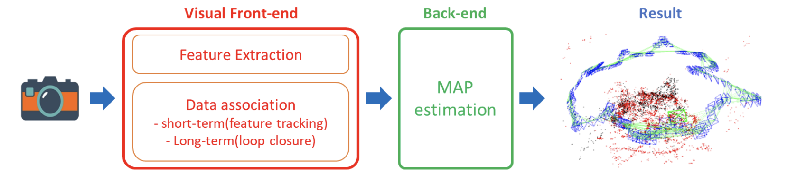
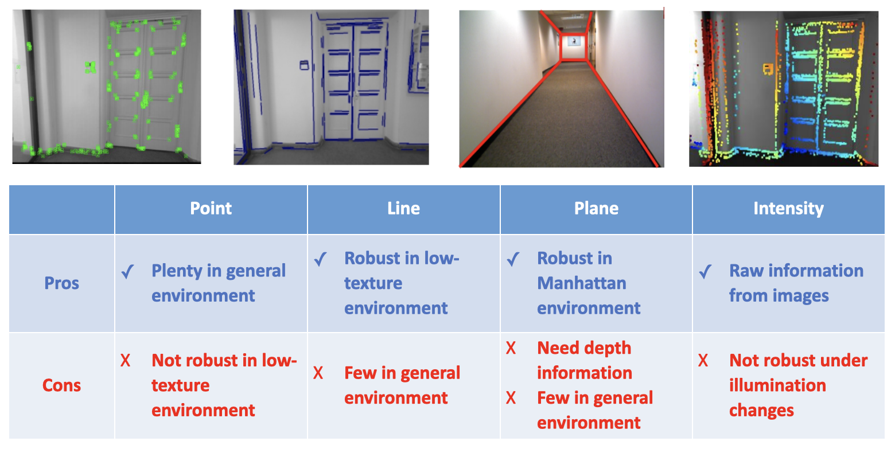
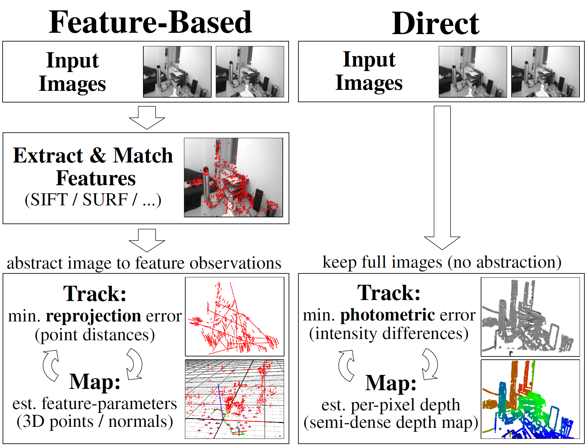
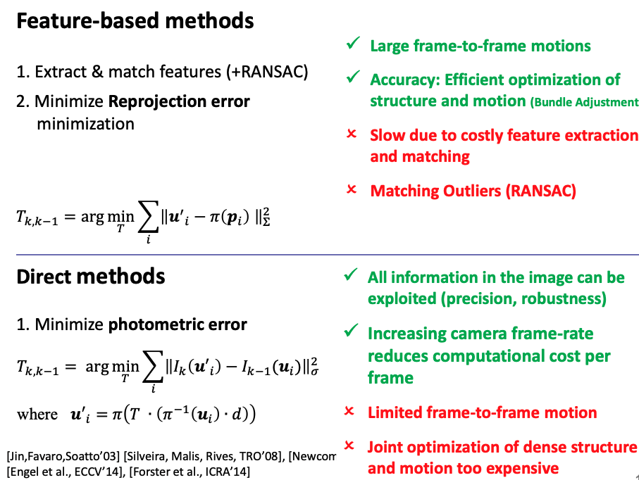
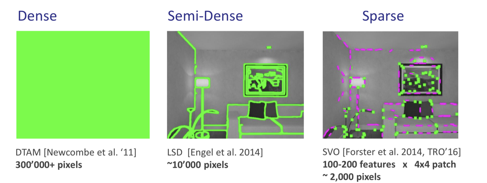
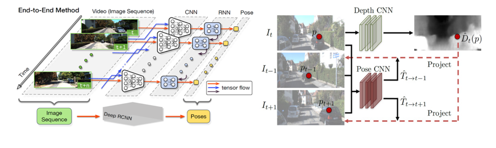

# Visual SLAM 기술개발 동향

 [SLAM 스터디 자료](study-resources.md)에서 언급하였듯이, 최신 비선형 최적화 기반의 SLAM 기술은 그 뿌리를 Visual SLAM에 두고 있으며, 자율주행 분야에서도 Visual SLAM은 활용도가 높기 때문에 해당 기술의 기술동향 및 유명한 연구실에 대해서 소개를 하도록 하겠습니다.

 컴퓨터 비전 분야에서 2000년대 초중반 여러 카메라에서 취득된 데이터를 이용하여 해당 물체의 3D 형상을 복원하는 3D Reconstruction (혹은 SFM (Structure From Motion) 혹은 BA (Bundle Adjustment)) 기법이 활발히 연구되었습니다. 그리고 이 기법에서 연구된 비선형 최적화 기법을 움직이는 차량, 로봇, 드론 등에 적용한 것이 최신 SLAM 기법이라고 이해하시면 됩니다.
 

 카메라 센서의 특징은 우선 센서의 크기가 작고 전력 소비도 크지 않은 반면 주변 환경에 대한 풍부한 정보를 얻을 수 있다는 점입니다. 단점은 3D 공간을 2D로 투영하기 때문에 3D 정보를 복원하는 것이 쉽지 않습니다. 단안 카메라 (mono-camera) 대신 양안 카메라 (stereo-camera)를 사용할 경우, 이러한 점을 극복할 수 있지만 양안 카메라에서 얻을 수 있는 3D 정보의 범위는 양안 카메라의 base-line의 크기와 연관되기 때문에 목표 시스템의 크기가 작다면 이 역시 적용이 어려운 편입니다. RGB-D 센서는 깊이 정보를 바로 얻을 수 있지만 특성 상 야외에서 사용하기 어렵습니다. 또한 주변 환경과 조명의 변화에 따라 동일한 환경도 다르게 보이기 때문에 문제가 발생하는 경우도 많습니다.

단안/양안 카메라 어느 것을 사용하더라도 라이다 수준의 정확한 깊이 정보를 얻는 것은 어렵습니다. 따라서 보통 SLAM 기법은 MVG (Multiple View Geometry)에 기반하여 깊이를 얻습니다. 이것은 동일한 물체를 서로 다른 위치에서 바라보면 삼각 측얄에 기반해서 해당 물체의 위치를 얻을 수 있다는 것에 기반합니다. 이를 위해서 우선 서로 다른 시간에 취득한 영상에서 동일한 지점을 찾고 연관지어야만 합니다. 결국 이러한 특징 인지와 연관을 어떻게 하느냐에 따라 기법들이 분류되지만 대부분의 경우 최적해를 구하는 Backend는 거의 대부분 factor graph 기반의 비선형 최적화를 사용하고 있습니다. 물론 여전히 필터링 기반의 최적화를 연구하는 연구실도 있으며, 이 경우는 리소스가 제한된 시스템 (소형 드론, 모바일 폰 등)에 적용되는 것을 고려한 경우가 많습니다.

일반적인 visual slam의 파이프라인은 다음과 같습니다.

간혹 visual odoemtry와 visual slam이 혼용되기도 하는데요. 정확하게는 visual odometry는 localization만 집중하는 것을 말하는 것입니다. 따라서 visual SLAM은 visual odometry에 추가로 mapping 및 loop detection을 통한 오차 최소화가 추가된 개념입니다. 물론 visual odometry를 통해서도 맵을 구성할 수 있지만 오차가 누적되기 때문에 local consistency만 가진다고 이야기할 수 있고, visual SLAM은 loop detection을 한 후, pose-graph optimizaiton을 통해서 global consistency까지 가진다고 이해할 수 있습니다.

그렇다명 영상에서 얻을 수 있는 특징은 어떤 것들이 있을까요?

여기서 주목할 특징은 intensity입니다. 이것은 영상이 가지고 있는 밝기 정보를 그대로 활용한다는 의미이며, 영상에서 별도의 특징을 추출하는 것은 indirect 방식, 영상이 가지고 있는 밝기 정보를 그대로 활용하는 것은 direct 방식이라고 합니다.

inderect 방식은 서로 다른 시점에 취득된 두 영상에서 특징을 추출하고 연관시킨 다음, 재투영 오차 (re-projection error)가 최소화되도록 최적화를 수행합니다.영상에서 특징을 추출하고 정합이 반드시 필요하기 때문에 영상에 대한 이런 전처리가 반드시 필요합니다. 하지만 이러한 전처리가 생각보다 많은 연산량을 요구합니다. 특히 해당 기술은 이미지의 크기기 크기 않았던 시기에 개발되었던 것들이 많아서 이를 큰 영상에 대해서 돌리면 더더욱 많은 연산량을 요구합니다. 또한 이러한 연산량 요구는 특징 추출이 어려운 환경에 있으면 더욱 크게 나타나고 결과도 좋지 않습니다. 이러한 단점 때문에 차라리 전처리를 하지 않으면 어떨까라는 생각을 한 연구자들이 생겨나고 이를 연구한 것이 direct 방식입니다.

direct 방식은 밝기 정보를 이용하여 밝기 차이가 최소화되도록 최적화를 수행합니다. 즉, 영상에서 특징을 추출하기 말고 영상의 밝기 정보를 그대로 이용해서 최적화를 하자는 말입니다. 말만 보면 dircet 방식이 더 뭔가 있어보이지만 결국은 direct 방식으로 최적화를 수행하려면 각 픽셀의 깊이 정보를 알아야만 합니다. 그래서 해당 연구를 수행한 연구실의 연구를 보면 처음에는 RGB-D 센서를 이용해 깊이를 아는 상황에서 연구를 수행하고 이를 일반적인 상황에서도 적용할 수 있도록 영상의 모든 픽셀 정보를 사용하는 것이 아니라 semi-dense하게 영상의 밝기 차이가 많이 발생하는 영역 위주로 정합하여 깊이 정보를 획득하거나 혹은 해당 영역에서 작은 patch에 대해서 깊이 정보를 획득하여 해당 특징을 이용하여 최적화를 수행합니다.
이 과정에서 깊이 정보는 서로다른 시간에 취득된 영상에서 해당 특징의 위치 차이가 크디 않다는 가정 하에서 intensity grdient에 기반한 탐색 기법을 통해 획득합니다. 결국 카메라가 높은 frame-rate을 가져서 위치 차이가 크지 않은 경우에만 이러한 탐색이 성공하기 때문에 두 연속된 시간에 획득한 영상의 차이가 크지 않은 경우에만 성능이 나오는 편이고, sparse하게 패치를 추출하여 최적화를 한다고 하더라고 그 수가 dircet 기법에서 추출한 특징 대비 많은 편이라 최적화에 필요한 연산량도 더 높은 편입니다.

이렇게만 보면 direct 기법이 indirect 기법 대비 가지는 장점이 크지 않은 것 같은데요. inderct 기법의 경우도 특징을 추출하고 연관하는 것에 많은 연산량을 필요로 하기 때문에 dircet 기법 대비 매우 가볍다고는 할 수 없고, 특징이 추출되니 않는 환경에서는 아예 최적화에 실패하는 경우도 많습니다. 하지만 2010 년도부터 카메라 하드웨어의 성능 개선으로 카메라가 제공할 수 있는 frame rate이 크게 증가하고 semi-dense 혹은 sparse한 특징 추출을 시도하여 연산량 측면에서도 실시간으로 운용하는게 가능해졌습니다.

더불어, direct 기법은 특징이 잘 추출되지 않는 환경에서도 더 강인한 추정 성능을 보여주고 사람이 보았을 때 주변환경에 대해서 구분 가능한 수준으로 조밀한 map을 제공할 수 있다는 점에서 각광 받고 있습니다. 일반적인 특징점 방식이 회전, 이동 등에 강인한 특징을 추출하는 것을 목적으로 하기 때문에 그런 조건에 해당하는 특징점이 적은 편이지만, direct 기법의 경우, 아래에서 볼 수 있는 것처럼 맵을 저장한 이후, 분류까지 수행가능하다고 합니다.

요즘은 딥러닝 기반의 visual SLAM 혹은 하이브리드 방식도 연구되고 있다고 합니다. 딥러닝 기반의 visual SLAM은 지도 학습과 비지도 학습으로 분류되며, 지도 학습 은 연속적인 영상과 그에 대응하는 카메라 자세 변화에 대한 학습데이터를 이용하여 입력 영상에 대한 자세 변화의 출력을 제공하는 종단간(end-to-end) 딥러닝 기술입니다. 지도 학습 기반의 방법으로 영상에서 특징 정보를 추출하기 위한 CNN과 순차적 자세 변화 추정을 위한 RCNN을 이용하여 입력 영상 시퀀스에 대한 카메라 자세를 출력하는 기술이 제안되었습니다. 비지도 학습 기반의 방법은 계산된 자세 변화와 뎁스로부터 다른 시점의 영상을 합성하고 이를 그 시점의 실영상과 비교하는 손실함수를 정의하고 학습한다고 합니다.

(S. Wang, R. Clark, H. Wen, and N. Trigoni, “DeepVO : Towards End-to-End Visual Odometry with Deep Recurrent Convolutional Neural Networks,” ICRA 2017, T. Zhou, M. Brown, N. Snavely, and D. G. Lowe, “Unsupervised Learning of Depth and Ego-Motion from Video,” CVPR, 2017.)

## 주요 논문

### Feature-based SLAM

* [ORB-SLAM (Mur-Artal, 2015)](https://webdiis.unizar.es/~raulmur/orbslam/)
  * modern visual SLAM의 기본적인 프레임워크를 완성함.
  * Tracking, local mapping, loop-closing의 3개의 스레드를 병렬적으로 수행함.
  * 연구실 레벨의 SLAM을 실제로 어플리케이션 레벨로 실제 사용가능하다는 가능성을 보여줌.
    * initialization, relocalization, loop-closing 등
    * CPU 레벨로도 실시간성 획득
  * 현재 2(2017), 3(2020)까지 나와있으며, 다양한 영상 센서 사용(2) 및 IMU를 이용한 visual-inertial SLAM(3)을 지원함.

* [VINS-Mono](https://github.com/HKUST-Aerial-Robotics/VINS-Mono)
  * drone에 사용할 수 있도록 단안 카메라를 이용한 SLAM
  * ORB-SLAM에서 제시되었던 visual-SLAM의 프레임워크를 발전시켜서 visual-inertal SLAM의 프레임워크를 완성시킴
  * IMU Preintegration + factor-graph optimization

### Photometry-based SLAM

* [LSD-SLAM](https://vision.in.tum.de/research/vslam/lsdslam?redirect=1)
  * Large sclae mapping을 direct 방식등로 구현함
  * LSD (Line Segment Detector)을 이용하여 edge을 추출 후 이를 이용함
  * Semi-dense map을 구축할 수 있지만 조명 변화나 빠른 움직임에 취약하다고 알려짐.
* [SVO](https://github.com/uzh-rpg/rpg_svo)
  * FAST coner detercter를 이용하여 특징을 추출하고 depth를 초기화한 다음, intensity 기반 feature tracking을 수행함.
  * localization 및 mapping은 indirect 기법처럼 재투영오차를 최소화하도록 최적화를 수행함.
  * 드론에 사용하기 위해서 빠른 연산 속도에 중점을 둠.
  * 현재 2까지 나와있으며 (소스 비공개), probablistic depth estimation을 통해 강인성을 향상시킴.
* [DSO](https://vision.in.tum.de/research/vslam/dso)
  * Sliding window phtometric bundle adjustment
  * 스테레오 카메라 적용 (2017), loop-closing (2018), IMU 적용 (2018)
  * 이미지 영역 겹침이 일정 비율 이상이면 Sparse, Semi-Dense, Dense로 최적화를 해도 성능의 큰 차이가 없음을 발견하고 실시간성을 높임.

## 주요 연구실

### [Scaramuzza @ETHz](https://rpg.ifi.uzh.ch/research_vo.html)

* Visual Inertial Odometry를 Drone에 적용하기 위해 활발히 2010년도 초중반 활발히 연구함.
* 현재 대부분의 SLAM에서 사용하고 있는 IMU-Preintegration 기법을 제안하여 Vision만 이용할 경우, 발생하는 scale ambiguity를 획기적으로 개선하고 Drone에 사용가능한 가벼운 VO 기법인 SVO 제안함.
* Drone을 이용한 EuroC dataset이 이 연구실에서 공개한 것임.
* 현재는 Event Camear와 Continuous-time trajectory estimation 쪽으로 연구를 진행하고 있음.

### [Stachniss @ Univ. Bonn](https://www.ipb.uni-bonn.de/)

* Probabilistic Robotics의 저자이며, SLAM 연구의 권위자 Wolfram Burgard 교수의 제자
* Grpah-Optimization 기반 Backend에 강점을 가지고 있으며, 초기 Computer Vision에 대한 연구와 Mapping 연구를 진행하였으며 (Octomap의 공저자 중 한 명), 현재는 라이다 기반 SLAM 및 학습기반 분류 및 인지에 대해서도 활발히 연구하고 있음.

### [Shaojie Shen @HUKST Aerial Robotics Group](https://uav.hkust.edu.hk)

* UPenn에서 드론을 이용한 Visual-Inertial SLAM을 연구하고 홍콩 과기대로 교수 부임 후 자신의 연구 결과를 집대성하여 VINS-Mono 발표함.
* Visual-Inertial SLAM을 일차적으로 완성(혹은 접근하기 편하게 정리)함.
* 코드의 정리도 매우 잘 되어 있음 (유럽 혹은 미국의 경우, 코드가 너무 객체 지향적이라 따라가기 어려운 편인데, 같은 아시아인이라서 그런지 상대적으로 이해하기 쉬움.)

### [Daniel Cremers @TUM Computer Vision Group](https://vision.in.tum.de/research)

* Computer Vision 혹은 Grphics 연구실인데, Dircect 기법을 제안한 이후, Direct 기법 기반 SLAM 쪽 연구를 활발히 진행 중임.
* LSD-SLAM과 DSO를 공개했으며, Direct 기법 기반의 Large environment SLAM에서 높은 성능을 보임.
* 독일 자동차 OEM과도 과제를 진행했다고 하며, 특히 Direct 기법에 기반한 Light-weight map 생성을 진행 중임.
  * [Direct Visaul SLAM and Autonomous System](https://vimeo.com/3804556140) @40:45
  * 현재 해당 기술을 이용한 스타트업 창립함.([Artisense](https://youtu.be/PBAmpYwAY3g))